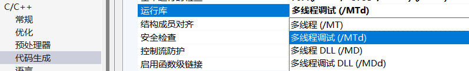
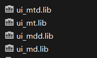

 <h1 align="center">真封神复活计划</h1>

三界大乱单机网

<br />

<p align="center">
    
  </a>

  <h3 align="center">仙魔改真封神计划！</h3>
  <p align="center">
    一个很疯狂也持续了很久的计划！！
    <br />
</p>


- [1.上手指南](#1上手指南)
  - [1.1 Clone](#11-clone)
  - [1.2 编译](#12-编译)
  - [1.3 项目说明](#13-项目说明)
    - [1.3.1 目录结构](#131-目录结构)
    - [1.3.2 命名方式](#132-命名方式)
    - [1.3.3 引擎工程](#133-引擎工程)
    - [1.3.4 客户端工程](#134-客户端工程)
    - [1.3.5 服务端工程](#135-服务端工程)
    - [1.3.6 工具工程](#136-工具工程)
- [2.详细开发文档](#2详细开发文档)
- [3.开发计划与进度](#3开发计划与进度)

------

### 1.上手指南

开发环境：visual studio 2022

#### 1.1 Clone

```
git clone https://github.com/reniao69/zfs.git
```

#### 1.2 编译

```
打开各个vs解决方案，编译game_engine—>编译其他
//TODO 后续将将写编译脚本一键编译
```

- [ ] 编写cmake编译脚本

#### 1.3 项目说明

##### 1.3.1 目录结构

```
├─Backup					vs旧版解决方案备份文件
├─bin    					编译生成的二进制文件 可以将客户端内容放在这里，方便调试gc
├─temp						编译生成的临时文件
├─docs						旧docs文档，将采用md重构
├─runtime					游戏运行时需要的dll等
├─SQL						游戏数据库文件
-------------------------
├─engine 					引擎头文件.h和编译生成的lib静态库，供客户端和服务端使用
├─sdk						服务端和客户端依赖的外部库
├─shared					服务端和客户端公用代码
├─game_engine				游戏引擎
├─game_client 				客户端gc
├─gameworld_server 			游戏世界服务器W
├─login_server 				游戏登录服务器L  
├─region_server 			游戏逻辑服务器R  
├─tool_character			模型编辑
├─tool_crashreport			崩溃日志工具
├─tool_files_packet			PAK打包解包工具
├─tool_max9_utility			3dmax9插件
├─tool_max_utility			3dmax插件
├─tool_scene				地图工具
└─tool_ui					ui工具
-------------------------
客户端 服务端 工具  
│      │      │  
└─── 引擎 ────┘
```

##### 1.3.2 命名方式

lib库的命名方式，根据不同的运行库命名，

 

 

exe命名方式：

xxx_Release.exe 

xxx_Debug.exe 

##### 1.3.3 引擎工程

```
Engine共分为8大模块：

Core是最基本的模块,为其他模块提供与操作系统相关的操作,以及一些最基本的公用函数；

Audio是音频模块；

FilePack是文件打包模块；

Graph是图形模块,封装了DX的一些操作；

Net是网络模块,封装着基本的Socket等操作；

UI模块提供大量与用户界面相关的控件；

Scene模块处理地形,场景物件,事件触发,环境因素等内容；

Character是角色模块,封装与角色相关的动画,材质,特效,骨骼,皮肤等等内容；
-------------------------------------------------------------------

Engine项目需要生成四种版本的库文件
Multi-Threaded 				*_mt.lib
Multi-Threaded Debug		*_mtd.lib
Multi-Threaded DLL 			*_md.lib
Multi-Threaded DLL Debug	*_mdd.lib
工具使用md版本
客户端和服务器端使用mt版本
```

##### 1.3.4 客户端工程

```
游戏客户端工程由于历史原因,存在多种配置,但目前只需要Debug和Release版本配置,其它配置无效。
生成采用Multi-Threaded的运行库方式,故Debug和Release版本均依赖于相应MT的运行库方式的engine库。
```

##### 1.3.5 服务端工程

```
生成采用Multi-Threaded的运行库方式,
故Debug和Release版本均依赖于相应Multi-Threaded的运行库方式的net库（是engine库的一个组件）。
```

##### 1.3.6 工具工程

```
tool_character			目录下存放着角色编辑器的源文件
tool_max_utility		目录下存放着max导出插件的源文件
tool_scene				目录下存放着场景编辑器的源文件
tool_ui					目录下存放着UI编辑器的源文件

由于历史原因,存在多种配置,但目前只需要Debug和Release版本配置,其它配置无效。
生成采用Multi-Threaded DLL的运行库方式
故Debug和Release版本均依赖于相应Multi-Threaded DLL的运行库方式的engine库。
```

##### 1.3.7 第三方库依赖

```
atl
boost
cppunit
curl
gperftools
ToolkitPro1850
max8
max9
mysql
python25 预替换为python3
sdl
```


------

### 2.详细开发文档

[1.引擎](./doc/engine.md)

2.客户端

3.服务端

...

------

### 3.开发计划与进度

- [x] 项目迁移至vs2022环境，更新相关依赖

  ```c++
  迁移说明：
  1. 项目中的hash_map全部替换为标准库unordered_map.
  最初的 C++ 标准库中没有类似 hash_map 的实现，
  但不同实现者自己提供了非标准的 hash_map。 
  因为这些实现不是遵循标准编写的，所以它们在功能和性能保证方面都有细微差别。
  从 C++ 11 开始，hash_map 实现已被添加到标准库中。
  但为了防止与已开发的代码存在冲突，决定使用替代名称 unordered_map。
  这个名字其实更具描述性，因为它暗示了该类元素的无序性。
  -------------------------------------------------------------------------------
  2. game_tool 引用的libxml++过于旧，改为tinyxml2,需要修复兼容性问题
  -------------------------------------------------------------------------------
  3. "error LNK2001: 无法解析的外部符号 _sscanf " 
  "error LNK2001: 无法解析的外部符号 __iob_func " 
  部分第三方库内使用了vs的printf和scanf等较老的接口,
  对于vs2013及更早版本编译的静态库，
  在vs及之后版本中提供了库 legacy_stdio_definitions.lib，
  该库提供了符号兼容性。
  但是，对于某些从通用 CRT 删除的符号，则无法提供兼容性符号。
  这些符号包括一些函数（例如，__iob_func）
  因此需要手动转换为新的符号
  // iob_func.cpp
  #include <stdio.h>
  // Define __iob_func to use __acrt_iob_func
  extern "C" FILE* __cdecl __iob_func(unsigned i) {
      // This assumes __acrt_iob_func is defined somewhere in the project or library
      return __acrt_iob_func(i);
  }
  extern "C" FILE* __cdecl _iob(unsigned i) {
      // This assumes __acrt_iob_func is defined somewhere in the project or library
      return __acrt_iob_func(i);
  }
  ```

  

- [ ] 阅读引擎源代码，重写md文档

  ```
  
  ```

  

- [ ] 阅读客户端代码，重写md文档

- [ ] ...
