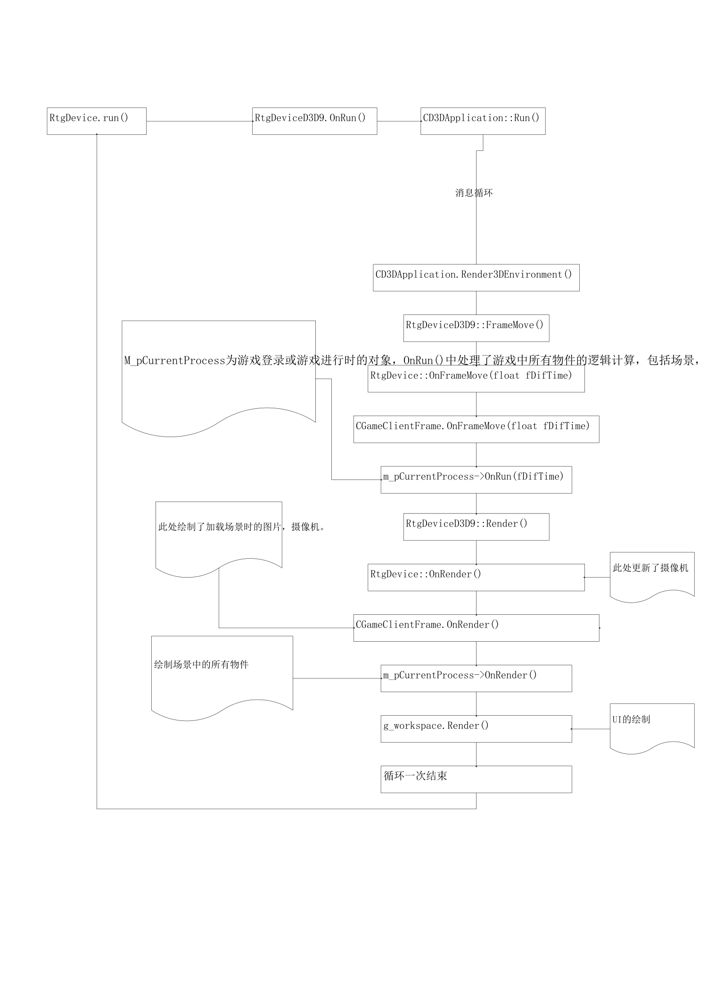

# game client  (gc) 文档

## 一、开发计划与日志

- [x] 修改登录动画
- [x] 修复材质帧动画
- [x] 添加登录流程锁帧逻辑 优化cpu占用
- [ ] 修改登录页面UI
- [ ] 确定游戏主题总共几个线程

## 二、流程分析



```c++
//应用程序的进入点
int APIENTRY WinMain(HINSTANCE hInstance, 
                     HINSTANCE hPrevInstance,
                     LPSTR lpCmdLine, 
                     int nCmdShow)
//初始化命令行配置信息
RtTextConfig cfgCommandLine(lpCmdLine);
//初始化核心库,读取配置文件，主要用来进行设备配置,窗口配置,图形配置,贴图设置,质量设置,摄像机设置等信息.
rtCoreInit("clt_engine.ini")
    
//创建包管理器,并读取game_client.pak包文件,主要用来对游戏中的资源文件的加密包读取操作..
CRtPackManager* pPackManager=new CRtPackManager;			
pPackManager->OpenPack("game_client.pak",false);

//创建CRtPackAndAnsiManager包管理器,用来管理CRtPackManage包管理器.
CRtPackAndAnsiManager*pAllManager=new CRtPackAndAnsiManager(pPackManager,&RtCoreFile());
RtCore::Instance().pFileManager=pAllManager;

//加载游戏配置文件version_config.ini,根据version_config.ini中的信息找到BootConfigFile配置文件config_boot.ini和GameRuleFile配置文件game_config.ini.
LoadConfig(std::string& vrError);

//根据config_boot.ini文件中的信息得到
//..\bin\language\chinese\Strmap.csv文件,
//Strmap.csv文件里记录着游戏中消息对应的提示信息.
const char* pStrmapPath = GetConfigBoot()->GetEntry("ConfigInfo","StrmapPath");

//在InitMapString函数内部加载Strmap.csv文件,遍历该文件并把该文件中所有信息添加到MAP结构变量s_mapString中.
InitMapString(pStrmapPath);

// 读取游戏配置文件.. \bin\version\chinese_gb\config\game.ini,并初始化游戏相关设置.
g_iniConfig = new RtIni();
if (g_iniConfig->OpenFile(R(INI_GAME)))
        GetGameIni()->GetEntry("graph_default", "FullScreen", &lIniFullscreen);
        GetGameIni()->GetEntry("graph_default", "WindowSizeX",&lIniResWidth);
        GetGameIni()->GetEntry("graph_default", "WindowSizeY",&lIniResHeight);
        GetGameIni()->GetEntry("graph_default", "ColorDepth", &lIniResColorDepth);
        GetGameIni()->GetEntry("graph_default", "texture",    &lIniTextureQuality);
        GetGameIni()->GetEntry("graph_default", "effect",     &lIniEffectQuality);
        GetGameIni()->GetEntry("graph_default", "shadow",     &lIniShadowQuality);
        GetGameIni()->GetEntry("graph_default", "fsaa",       &lIniFsaa);
        GetGameIni()->GetEntry("graph_default", "envref",     &lIniEnvref);
        GetGameIni()->GetEntry("graph_default", "objref",     &lIniObjref);
        GetGameIni()->GetEntry("graph_default", "posteffect", &lIniPosteffect);
        GetGameIni()->GetEntry("graph_default", "objeffect",  &lIniObjeffect);
        GetGameIni()->GetEntry("Audio", "DefaultMusicVal",    &lIniMusicVolume);
        GetGameIni()->GetEntry("Audio", "DefaultSoundVal",    &lIniSoundVolume);
        GetGameIni()->GetEntry("Audio", "Audio3d",            &lUse3DAudio);

//读取用户配置文件user.ini,初始化用户相关配置信息
            iniUser.GetEntry("graph", "fullscreen", &lIniFullscreen);
            iniUser.GetEntry("graph", "width",      &lIniResWidth);
            iniUser.GetEntry("graph", "height",     &lIniResHeight);
            iniUser.GetEntry("graph", "color",      &lIniResColorDepth);
            iniUser.GetEntry("graph", "texture",    &lIniTextureQuality);
            iniUser.GetEntry("graph", "effect",     &lIniEffectQuality);
            iniUser.GetEntry("graph", "shadow",     &lIniShadowQuality);
            iniUser.GetEntry("graph", "fsaa",       &lIniFsaa);
            iniUser.GetEntry("graph", "envref",     &lIniEnvref);
            iniUser.GetEntry("graph", "objref",     &lIniObjref);
            iniUser.GetEntry("graph", "posteffect", &lIniPosteffect);
            iniUser.GetEntry("graph", "objeffect",  &lIniObjeffect);
            iniUser.GetEntry("graph", "capture",    &lCaptureVideo);
            iniUser.GetEntry("audio", "music",      &lIniMusicVolume);
            iniUser.GetEntry("audio", "sound",      &lIniSoundVolume);
            iniUser.GetEntry("audio", "use3d",      &lUse3DAudio);

// 取得向导服务器的IP地址和端口，并且去取得GameWorld服务器列表
if (szGuideIP)   { strncpy(g_szGuideServerHostIP, szGuideIP, 39); g_szGuideServerHostIP[39] = 0;}
if (szGuidePort) {g_iGuideServerHostPort = atoi(szGuidePort);}
GcLogin::StartGetGameWorldServer();

// 取得Log Server的IP地址和端口,并对相关错误设置事件回调函数GameClientGuardErrorCallBack
if (szLogIP) strcpy(g_szLogServerHostIP, szLogIP);
if (szLogPort) g_iLogServerHostPort = atoi(szLogPort);
rtSetGuardErrorCallback(GameClientGuardErrorCallBack);

//读游戏版本文件,修改注册表.
ReadVersionFile(R(INI_VERSION));
CGameRegistry WinReg;
WinReg.Init(); 
if (!iniUser.GetEntry("game", "log"))
   {
      if (iniUser.OpenFile(R(INI_USER), true))
         {
            if (!iniUser.FindSection("game"))
              {
                  iniUser.AddSection("game");
              }
               iniUser.AddEntry("game", "log", (long)1);
               iniUser.CloseFile();
               SendSystemInfo();
         }
   }

//初始化图形系统
rtGraphInit();
//创建D3D设备并进行初始化
g_pDevice = rtCreateDeviceD3D9();
if(!GetDevice()->Init(hInstance, RT_RUNTIME_CLASS(CGameClientFrame), 
	RT_RUNTIME_CLASS(GcCamera), "clt_graph.ini", "user.ini"))
// 初始化声音系统，并播放背景音乐
if (!rtSoundInit("RT3D-Audio", (HWND)GetDevice()->GetWndHandle()))
if (!rtMusicInit())		
g_pBackMusic->SetMusicPath("music");
g_pSoundMgr->SetAudioPath("audio");
const char* szMusicFileName = GetGameIni()->GetEntry("Audio", "LoginMusic");
//创建应用程序框架
g_pGameClientFrame = ((CGameClientFrame*)g_pDevice->GetEvent());
g_pGameClientFrame->EnableNotifyOnMouseMove(true);
//初始化场景系统
if (!rtSceneInit("RT3D-Scene"))
g_pScene = new GcScene;
if (!g_pScene->OnceInit(g_pDevice))                  |
//初始化人物系统并注册人物资源路径.        
if (!ActorInit())
ActorRegisterPath("creature/actor/");
ActorRegisterPath("creature/material/");
ActorRegisterPath("creature/effect/");
ActorRegisterPath("scene/actor/");
ActorRegisterPath("scene/material/");
ActorRegisterPath("scene/effect/");
ActorSetScene(g_pScene);
//进入登陆状态,创建GcLogin对象,设置程序为登陆状态
if (!((CGameClientFrame*)g_pGameClientFrame)->OnEnterLogin())
/*-----------------程序的核心流程在这里------------------------*/
bool CGameClientFrame::OnEnterLogin()
{
    guard;
    CHECK(m_pLogin==NULL);
    m_pLogin = new GcLogin(this);//创建GcLogin对象
    if (m_pLogin==NULL)
    {
        return false;
    }

    if (!m_pLogin->InitOnce())//对GcLogin类成员变量进行初始化
    {
        DEL_ONE(m_pLogin);
        m_pCurrentProcess = NULL;
        return false;
    }
    /*
    在GcLogin的构造函数中
    m_eStatus = GLS_NONE;
    m_eNextStatus = GLS_NONE;
    因为m_eStatus=GLS_LOADING为游戏加载状态,
    根据switch-case语句的判断执行函数EnterLoading(),
    在EnterLoading函数内部又会执行m_bLoading = false;
    UILayer::EnterLoading();
    而UILayer::EnterLoading()函数主要功能是从拼接的四副图片中随机选取一副作为游戏的开场画面.
    */
    void GcLogin::SetLoginState(EStatus eState)
{
    guard;
    m_ePrevStatus = m_eStatus;
    m_eNextStatus = eState;

    // 离开
    bool bLeaveNow = true;
    switch (m_eStatus)
    {
    case GLS_LOADING:
        LeaveLoading();
        break;
    case GLS_SELECT_GAMEWORLD_SERVER:
        bLeaveNow = LeaveSelectGameWorldServer();
        break;
    case GLS_LOGIN:
        bLeaveNow = LeaveLogin();
        break;
    case GLS_SELECT_CHAR:
        bLeaveNow = LeaveSelectChar();
        break;
    case GLS_SELECT_FACTION:
        bLeaveNow = LeaveSelectFaction();
        break;
    case GLS_CREATE_CHAR:
        bLeaveNow = LeaveCreateChar();
        break;
    case GLS_CREATE_CHAR_ANI:
        bLeaveNow = LeaveCreateCharANI();
        break;
    }

// 设置
    if (!bLeaveNow)
    {
        return;
    }else
    {
        m_eNextStatus = GLS_NONE;
        m_eStatus = eState;
    }

    // 进入
    switch (m_eStatus)
    {
    case GLS_LOADING:
        EnterLoading();
        break;
    case GLS_SELECT_GAMEWORLD_SERVER:
        if (m_eStatus!=GLS_LOGIN)
        {
            m_mapActor = m_mapLogin;
        }
        EnterSelectGameWorldServer();
        break;
    case GLS_LOGIN:
        if (m_eStatus!=GLS_SELECT_GAMEWORLD_SERVER)
        {
            m_mapActor = m_mapLogin;
        }
        EnterLogin();
        break;
    case GLS_SELECT_CHAR:
        m_mapActor = m_mapSelectChar;
        EnterSelectChar();
        break;
    case GLS_SELECT_FACTION:
        m_mapActor = m_mapCreateChar;
        EnterSelectFaction();
        break;
    case GLS_CREATE_CHAR:
        m_mapActor = m_mapCreateChar;
        EnterCreateChar();
        break;
    case GLS_CREATE_CHAR_ANI:
        m_mapActor = m_mapCreateANI;
        EnterCreateCharANI();
        break;
    }
    if (m_eStatus!=GLS_NONE)
    {
        UpdateCameraPos();
    }
    unguard;
}
/*------------------------------------------------------------*/
    ((GcScene*)g_pScene)->SetWorld(NULL);
    m_pCurrentProcess = m_pLogin;
    return true;
    unguard;
/*------------------------------------------------------------*/
//渲染场景,内部会调用OnBeginRender(),OnRender(),OnEndRender().
//在OnRender()函数内部将成员变量m_bLoading=true.
  if (m_eStatus==GLS_LOADING)
    {
        if (m_bLoading)
        {
            OnLoading();
            SetLoginState(GLS_SELECT_GAMEWORLD_SERVER);
        }else
        {
            m_bLoading = true;
        }
}
/*------------------------------------------------------------*/
GetDevice()->RenderScene();
// 应用程序框架初始化
if (!g_pGameClientFrame->Init(g_pDevice/*hInstance, g_hGCWnd, g_hGCWnd*/))
/*应用程序逻辑运行:
在函数Run()内部调用OnBeginRender(),OnRender(),OnEndRender()

在OnRender()函数内部因为m_bLoading=true,执行语句OnLoading();SetLoginState(GLS_SELECT_GAMEWORLD_SERVER)
而在GcLogin::OnLoading()函数内部会读取登录界面配置文件scene/login2.ini
并将
Login,
SelectChar,
CreateChar,
CreateANI段下的内容分别加入到m_mapLogin,m_mapSelectChar,m_mapCreateChar,m_mapCreateANI四个MAP结构中

然后打开登陆界面UILayer::EnterLogin()
在UILayer::EnterLogin()函数内部创建UILayerLogin对象
在UILayerLogin的构造函数中,先加载ui/ui_layer_login.xml层文件,为每一个UI控件添加事件响应函数.

SetLoginState(GLS_SELECT_GAMEWORLD_SERVER)
进入EnterSelectGameWorldServer();
在EnterSelectGameWorldServer()函数内部显示游戏登陆界面,加载世界服务器列表,设置背景物件

当玩家点击服务器列表按钮,回调命令响应函数OnClicked_EnterLogin()
在OnClick_EnterLogin()函数内部调用GetLogin()->SelectGameWorld(m_iCurrentSelectServer-1)
在SelectGameWorld()函数内部将服务器名,IP地址,Port端口赋给相应成员变量,设置游戏为登陆状态SetLoginState(GLS_LOGIN);
在GLS_LOGIN状态下调用EnterLogin()函数,在EnterLogin()函数内部设置背景物件,从user.ini文件中读取用户名和密码,
或者是从编辑控件中读取输入的用户名和密码
当用户点击“确认”按钮时,响应命令回调函数OnClicked_Login()
在OnClicked_Login()函数内部检查登陆用户名和密码是否有效
并用该用户名和密码登陆服务器
同时将用户名和密码保存在本地文件user.ini中.
*/
void UILayer::EnterLogin()
{
	guard;

	Reset();

	g_layerLogin = new UILayerLogin;

	g_workspace.AdjustLayer(GetDevice()->m_iWndWidth, GetDevice()->m_iWndHeight);

	LeaveLoading();

	unguard;
/*
当玩家点击进入游戏按钮时,回调命令响应函数OnClicked_Enter()
在OnClicked_Enter()函数内部调用OnSelectUser()
而OnSelectUser()里实现加载状态图片的显示和向网络发包
网络代理类GcLoginSession将会响应g2c_select_char命令
在该命令响应函数中会调用ChangeGameFlow()来改变游戏顺序
在ChangeGameFlow()内部将m_bNextGameFlow,m_bChangeGameFlowNextFrame置为true
游戏中每帧都会调用OnFrameMove(),而OnFrameMove()里检查m_bNextGameFlow, m_bChangeGameFlowNextFrame的值,
从而决定程序的流程,在OnFrameMove()函数内部会调用OnEnterGame()
而OnEnterGame()里主要是做进入游戏世界的初始化工作,如新建客户端的世界,新建玩家角色,显示主界面,初始化场景,角色系统,道具系统,好友和邮件系统,城战系统,发射物系统,摄像机的基本属性.
*/
void UILayerSelectChar::OnClicked_Enter(void*, void*)
{
	guard;
    if (GetLogin())
    {
        if (GetLogin()->GetStatus()==GcLogin::GLS_SELECT_CHAR)
        {
            GetLogin()->OnSelectUser();
        }
    }
	unguard;
}
void GcLogin::OnSelectUser()
{
    guard;
    if (m_iCurSelectChar>=0 && m_iCurSelectChar<3)
    {
        UILayer::EnterLoading();
        SelectChar(GetAccountInfo().users[m_iCurSelectChar].id);
    }else
    {
        ShowMessage(R(LMSG_PLS_CHOOSE_CHAR));
    }
    unguard;
}
bool GcLoginSession::SelectChar(long id)
{
	CG_CmdPacket& cmd = BeginSend();

	if (!cmd.WriteShort(c2g_select_char))
		return false;

	if (!cmd.WriteLong(id))
		return false;

	return EndSend();
}
BEGIN_CMD_FUNC(cmd_g2c_select_char_ret)
{
	long charID;
    if (!packet->ReadLong(&charID))
		return false;
    if (charID)
    {
        long seed;
        char* regionHost;
        short regionPort;
        if (!packet->ReadLong(&seed))
            return false;	
        if (!packet->ReadString(&regionHost))
            return false;
        if (!packet->ReadShort(&regionPort))
            return false;
	    // 进入此处,LoginSession任务完成了，会被GWServer断开连接，连RegionServer了
        GetLogin()->SetLoginState(GcLogin::GLS_NONE);
        GetLogin()->OnNetSelectCharDone();
        //在ChangeGameFlow()内部将m_bNextGameFlow, m_bChangeGameFlowNextFrame置为true.
        //游戏中每帧都会调用OnFrameMove(),而OnFrameMove()里检查m_bNextGameFlow, m_bChangeGameFlowNextFrame的值,从而决定程序的流程.
        ChangeGameFlow(true);
        SetRegionServerInfo(charID, seed, regionHost, regionPort);
    }else
    {
        char* szErrMsg;
        if (!packet->ReadString(&szErrMsg))
            return false;
        UILayer::LeaveLoading();
        ShowMessage(szErrMsg);
    }
}
END_CMD_FUNC;
void CGameClientFrame::OnFrameMove(float fDifTime)
{
    guard;
    rtClock(m_sTimerRun);
    CHECK(GetDevice()->m_pCamera!=NULL);
    if (m_bChangeGameFlowNextFrame)
    {
        m_bChangeGameFlowNextFrame = FALSE;
        if (m_bNextGameFlow)
        {
			int point = m_pLogin->GetPoint();
            this->OnLeaveLogin();
            this->OnEnterGame();
			//Heten
			if (m_pWorld && m_pWorld->m_pPlayer)
			{
				m_pWorld->m_pPlayer->m_Point = point;
			}
			//end
        }else
        {
            this->OnLeaveGame();
            this->OnEnterLogin();
        }
    }

    if (!VaildCamera())
    {
        return;
    }

    GetTimer()->Run(GetDevice()->GetAppTime());
    if (m_pCurrentProcess)
    {
        m_pCurrentProcess->OnRun(fDifTime);
    }
    rtUnclock(m_sTimerRun);
    unguard;
}
bool CGameClientFrame::OnEnterGame()
{
    guard;
    CHECK(m_pWorld==NULL);
    m_pWorld = new GcWorld(this);
    if (m_pWorld==NULL)
    {
        return false;
    }

    if (!m_pWorld->InitOnce())
    {
        DEL_ONE(m_pWorld);
        m_pCurrentProcess = NULL;
        return false;
    }
	m_pWorld->m_pItemManager = m_pItemManager;
    ((GcScene*)g_pScene)->SetWorld(m_pWorld);
    m_pCurrentProcess = m_pWorld;
    m_pWorld->EnterGame();
    // 重新连接Region Server
    m_pWorld->EnterRegionServer();
    return true;
    unguard;
}
bool GcWorld::EnterGame()
{
    guard;
    RtScene::m_bRenderScene = TRUE;
	UILayer::EnterMain();
	m_UIProject.Init();
    g_pScene->Init();
    m_ActorManager.Init();
    m_synchroItems.Init();
    m_pPlayer = new GcPlayer;
    m_pPlayer->SetActorType(GcActor::ENT_USER);
    //发射物体管理类
	m_pMissileManager=new CMissileManager;
	//聊天的初始化
	m_Chat.Init();
	m_Team.Init();
	m_MasterList.Init();
	m_Friend.Init();
	m_Mail.SetFriendList(&m_Friend);
	m_Mail.Init();
	//m_Mail.Reset();
    // 设置默认摄像机属性
    float fFOV              = 45.0f;
    float fAspect           = 4.f/3.f;
    float fCameraNear       = 10.0f;
    float fCameraFar        = 1000.0f;
    m_fCameraDefaultYaw       = -45.f;
    m_fCameraDefaultDegree    = 38.f;
    m_fCameraMinDistance      = 100.f;
    m_fCameraMaxDistance      = 100.f;
    m_fCameraDefaultDistance  = 100.f;
    GetGameIni()->GetEntry("Camera", "FOV",             &fFOV);
    GetGameIni()->GetEntry("Camera", "Aspect",          &fAspect);
    GetGameIni()->GetEntry("Camera", "Near",            &fCameraNear);
    GetGameIni()->GetEntry("Camera", "Far",             &fCameraFar);
    GetGameIni()->GetEntry("Camera", "DefaultYaw",      &m_fCameraDefaultYaw);
    GetGameIni()->GetEntry("Camera", "Degree",          &m_fCameraDefaultDegree);
    GetGameIni()->GetEntry("Camera", "MinDistance",     &m_fCameraMinDistance);
    GetGameIni()->GetEntry("Camera", "MaxDistance",     &m_fCameraMaxDistance);
    GetGameIni()->GetEntry("Camera", "DefaultDistance", &m_fCameraDefaultDistance);
    GetGameIni()->GetEntry("Camera", "MouseSpeed",      &fMouseSpeed);
    GetDevice()->m_pCamera->SetProjParams(DegreeToRadian(fFOV), fAspect, fCameraNear, fCameraFar);
    SetDefaultCamera();
    m_eCameraMode = CAMERA_MODE_TURN;
	GetDevice()->SetFogEnable(TRUE);
    
	// pre cache actor
	ActorPrecache("pf01.act","actor");
	ActorPrecache("ph01.act","actor");
	ActorPrecache("pt01.act","actor");
	ActorPrecache("pn01.act","actor");
    ActorPrecache("iii001.act","actor"); // 地上的钱箱
    ActorPrecache("epn_wait.act","actor");
    ActorPrecache("flysword_path.act","actor");
    ActorPrecache("flysword_rib.act","actor");
    ActorPrecache("fabao.act","actor");
    ActorPrecache("eborn.act","actor");
    ActorPrecache("eff_task_finish","actor");
    ActorPrecache("eff_task","actor");
    ActorPrecache("target","actor");
    ActorPrecache("elevup","actor");
    ActorPrecache("eff_water_at","actor");
    ActorPrecache("eff_bomb_at","actor");
    ActorPrecache("eff_ice_at","actor");
    ActorPrecache("eff_posion_dot","actor");
    m_pAliasButton = (RtwAliasButton*)g_workspace.LookupWidget("fmhotkey.lbhotkeyenable");
	LOAD_UI("fmhp")->Show();
	LOAD_UI("fmdialg")->Show();
	//LOAD_UI("fmchannelbtn")->Show();
	LOAD_UI("fmhotkey")->Show();
	LOAD_UI("fmsystem")->Show();
	LOAD_UI("fmmaptitle")->Show();
	LOAD_UI("fmmap")->Show();
	LOAD_UI("fmfeedback")->Show();
	LOAD_UI("panSysteminfo")->Show();
	LOAD_UI("fmsetting.tabsystem.fmgame.btndefault")->Enable();
	return true;
    unguard;
}

}
//经过调试知,OnFrameMove()是在Run()中不断被调用的
GetDevice()->Run()
// 应用程序框架退出
g_pGameClientFrame->Close();
// 人物系统退出;
ActorExit();        
// 场景系统退出
rtScenePreExit();
rtSceneExit();
// 声音系统退出
rtAudioPreExit();
rtAudioExit();
// 图形系统退出
rtGraphExit();
// 删除应用程序框架
DEL_ONE(g_pGameClientFrame);
ClearMapString();
// 核心库退出
rtCoreExit();


```
