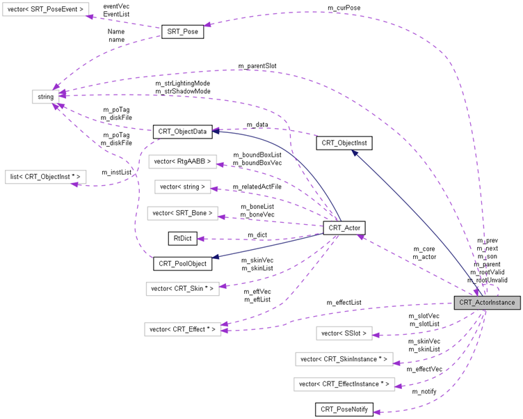
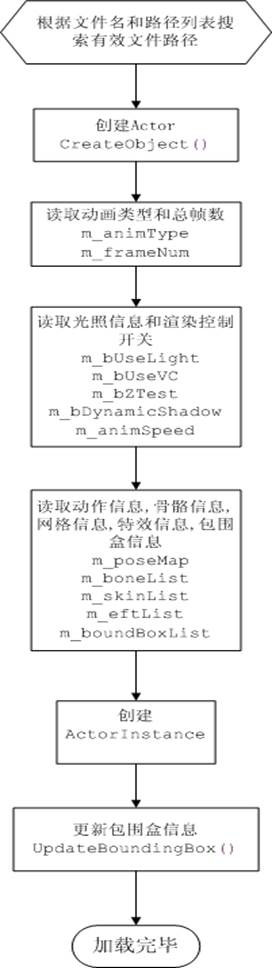
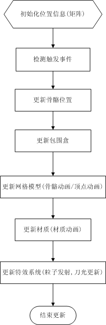
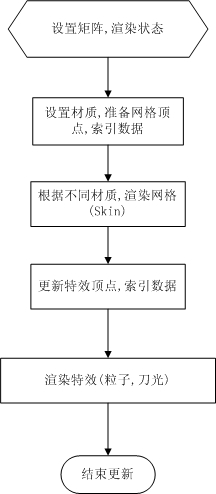

# Character


## 1.引言

### 1.1 定义
Character模块是用来封装图形系统中的网格模型,模型动画,粒子系统,特效等,翻译成角色模块并不合适, 所以保守使用character.

*Actor是是character的核心,它是对模型,骨骼,动画,特效,材质的聚合.

### 1.2 背景

Character对模型动画,粒子系统等处理都是基于CPU处理的,几乎没什么利用GPU的硬件加速,这样可以使其在低端图形卡机器上可以运行,但对于高端图形卡就显得过于低效,将来可以针对现代的图形卡优化.


## 2.主要功能和性能

网格模型,动画数据,骨骼信息,材质信息,特效的序列化读取和存储

网格模型渲染

骨骼动画

顶点动画

粒子系统,刀光,残影

## 3.模块关系
主要模块关系

详细图


## 4.加载流程

 

## 5.更新流程

 


## 6.渲染流程

 


## 7.函数接口及类的说明

### 7.1全局接口

```c++
// 初始化character模块,必须在使用character模块任何功能前调用
// 主要是对一些动态类型进行注册
bool ActorInit();
// 退出character模块
bool ActorExit();
// character模块中的数据管理器(分配,复制)
CRT_Pool *ActorPool();
// 注册文件搜索路径
void ActorRegisterPath(const char *path);
// 设置质量
void ActorSetQuality(EActorQuality &actor,
                     EActorQuality &skin,
                     EActorQuality &mtl, 
                     EActorQuality &effect);

void ActorGetQuality(EActorQuality &actor,
                     EActorQuality &skin,
                     EActorQuality &mtl,
                     EActorQuality &effect);
// 创建actor实例
CRT_ActorInstance *LoadActorInstance(const char *name);
// 创建skin实例
CRT_SkinInstance *LoadSkinInstance(const char *name);
// 创建特效
CRT_Effect       *LoadEffect(const char *name);
```

### 7.2结构和类型

```c++
// 渲染子集(subset),网格(skin) 根据不同的材质和纹理分成不同的子集渲染
struct SRT_RenderSurface
{
 	string Material;   // 材质名
 	string Texture;    // 纹理名
 	vector<short> IdxList; // 索引数据
};
// post触发事件
struct SRT_PoseEvent
{
	string   Action;     // 事件类型
	string   Param;      // 参数
	string   Param1;     // 针对animation,表pose名
 	string   Param2;     // 针对animation,表挂接点
	long KeyFrame;      // 触发帧
};

// 动作
struct SRT_Pose
{
string   Name;  // 名字
long StartFrm;    // 开始帧
long EndFrm;    // 结束帧
vector<SRT_PoseEvent> EventList;   // 触发事件列表
};

// 刀光帧
struct SRibbonFrame
{
short segNum; // 段数
vector<SRT_VaVtxPos> pos;    // 位置
};
```

### 7.3模块和类

#### 7.3.1 骨骼

```c++
struct SRT_Bone 
{
    string       Name;         // 骨骼名
    string       ParentName;     // 父骨骼名
    vector<RtgVertex3> TransList;  // 平移变换
    vector<RtgVertex4> RotatList;   // 渲染变换
    bool    AbsMode;           // 是否使用绝对位置模式
    bool    ExportTranslate;   
    bool    isPaint;            //是否绘制
    vector<SRibbonFrame> ribbonFrame; // 刀光帧
    // runtime var,don't serialize
    vector<SRT_Bone*> childList; // 子骨骼
    RtgMatrix12 skinMat;         // 当前骨骼矩阵
    RtgMatrix12 normMat;        // 当前法线骨骼矩阵
// 更新到指定帧
    void UseFrame(float frame);
    void UseFrame(RtgMatrix12 &parent,float frame);
};
// 骨骼引用
struct SRT_BoneRef
{
    unsigned char Idx;     // 索引
    float Weight;       // 权重
    RtgVertex3 PosOffset;  // 位置偏移
    RtgVertex3 NorOffset; // 法线偏移
    SRT_Bone *bone;     // 骨骼
};
```


#### 7.3.2 特效

```c++
class CRT_Effect : public CRT_PoolObject
{
// 是否需要更新
virtual bool RequestTick() = 0;
// 更新
virtual void Tick(unsigned long delta) = 0;
virtual bool RequestUseFrame() = 0;
virtual void UseFrame(unsigned long frame) = 0;
// 初始化
virtual bool Init(RtgDevice *dev,CRT_ActorInstance *actor) = 0;
// 渲染
virtual void Render(RtgDevice *dev,RTGRenderMask mask) = 0;
// 名字
virtual const char *GetName() = 0;
virtual void SetName(const char *name) = 0;
};

class CRT_EffectBase : public CRT_Effect
    
// 粒子发射器
class CRT_EffectEmitter : public CRT_EffectBase
{
// 储存相关
virtual long Serialize(RtArchive& Ar);
// 创建
 virtual CRT_PoolObject *NewObject() {
CRT_EffectEmitter *t = (CRT_EffectEmitter*)ActorPool()->Load(RT_RUNTIME_CLASS(CRT_EffectEmitter));
       *t = *this;
       t->m_poType = POOL_TYPE_MEMORY;
       t->m_delta = 0;
       t->m_pActive = NULL;
       t->m_pDead = NULL;
       t->m_actor = NULL;
       t->m_parentMat = NULL;
       t->m_destMat = NULL;
       return t;

    }
// 初始化
    virtual bool Init(RtgDevice *dev,CRT_ActorInstance *actor);
// 更新
    virtual void Tick(unsigned long delta);
// 渲染
    virtual void Render(RtgDevice *dev,RTGRenderMask mask);
// 更新相关
    virtual bool RequestTick() { return true; }
    virtual bool RequestUseFrame() { return m_keyList.Size()!= 0; }
    virtual void UseFrame(unsigned long frame);
// 单个粒子
    struct SParticle
    {   
       long Life;      // 生命

       RtgVertex3 Speed; // 速度

       RtgVertex3 Acc; // 加速度

       RtgVertex3 Pos; // 当前位置

       float Size;       // 大小  

       float Opaque; // 透明度

       float Scale;   // 缩放

       RtgVertex3 Color; // 颜色

       long TexIdx;    // 纹理

       SParticle *Next;   // 下一个

    };
    
// 删除/创建粒子

    void DelParticle(SParticle *p);
    SParticle *NewParticle();
    
// 发射器帧
    struct SEmitterKey
    {
       bool bEnable;   // 是否有效
       float EmiSpeed;   // 发射速度
// 插值

       void Interpolate(unsigned long frame,unsigned long f1,SEmitterKey &k1,

           unsigned long f2,SEmitterKey &k2)

    };
// 发射帧列表
    keyframe<SEmitterKey> m_keyList;
// 粒子生命
    long m_parLife;     
// 发射数量
    float m_emiSpeed;        
// 大小范围

  float   m_sizeMin,m_sizeMax;

    RtgVertex3 m_emiSizeMin,m_emiSizeMax;

// 混合类型

    long   m_alphaType;

    string   m_alphaOpt; 

    bool   m_bAlwaysFront;

 

// 纹理相关

    string     m_texture;

    long    m_texUSub;

    long    m_texVSub;

    bool   m_bTexSub;

    bool   m_bTexRand;

    // 加速度范围

    RtgVertex3 m_accMin,m_accMax;

    RtgVertex3 m_speedMin,m_speedMax;

    bool   m_bSquirt;

    bool   m_bUseParentRotate;

    bool    m_bUseParentCoor;

    // com type

    string m_dest;

    long  m_destTime;

    long  m_destSpeedRand;

    RtgMatrix12 *m_destMat;

    // runtime var

    long     m_delta;

    RtgShader  m_ro;      // 材质

    SParticle *m_pActive;     // 活动粒子

    SParticle *m_pDead;      // 消失粒子

    CRT_ActorInstance *m_actor;   

    long     m_lastFrame;

    bool     m_rtEnable;

    long     m_rtEmiSpeed;

    long     m_rtSquirtNum;

 

};

// 刀光

class CRT_EffectRibbon2 : public CRT_EffectBase

{
	// 读取/存储
    virtual long Serialize(RtArchive& Ar);
    // 创建
    virtual CRT_PoolObject *NewObject() {

       CRT_EffectRibbon2 *t = (CRT_EffectRibbon2*)ActorPool()->Load(RT_RUNTIME_CLASS(CRT_EffectRibbon2));

       // LOG2("head = %s,tail = %s\n",m_head.c_str(),m_tail.c_str());

       *t = *this;

       t->m_poType = POOL_TYPE_MEMORY;

       t->m_actor = NULL;

       t->m_list.clear();

       t->m_lastFrame = 0;

       t->m_ribbonPerFrame = 0;

       t->m_headBone = NULL;

       t->m_tailBone = NULL;

       // LOG2("t.head = %s,t.tail = %s\n",t->m_head.c_str(),t->m_tail.c_str());

       return t;

    }

 

    // 初始化

    virtual bool Init(RtgDevice *dev,CRT_ActorInstance *actor);

// 更新

    virtual void Tick(unsigned long delta);

// 渲染

    virtual void Render(RtgDevice *dev,RTGRenderMask mask);

// 更新相关

    virtual bool RequestTick() { return true; }

    virtual bool RequestUseFrame() { return m_keyList.Size()!=0; }

    virtual void UseFrame(unsigned long frame);

 

    // 刀光帧

    struct SRibbonKey2

    {

       long fadeOutFrame,endFrame;   // 淡出,消失帧

       long life,fadeIn,fadeOut;       // 生命,淡入,淡出时间

       

// 插值

       void Interpolate(unsigned long frame,unsigned long f1,SRibbonKey2 &k1,

           unsigned long f2,SRibbonKey2 &k2)

       {

           // float b = ((float)frame - f1)/(f2 - f1); 

           // interval = k1.interval;

       }

    };

 

// 刀光片

    struct SPiece

    {   

       SRibbonKey2 keyFrame;   // 刀光帧

       int begFrame;           // 开始帧

       int endFrame;           // 结束帧

 

       void Init() 

       {

 

       }

       vector<RtgVertex3> verList;    // 位置

       vector<float> uvList;          // 纹理坐标

    };

 

    // 获取三角面

    void GenTri(int frame,SPiece *p);

    // void Slerp(RtgMatrix12 &mat,SRT_Bone *bone,int frame,float r);

 

// 删除片

    void DelPiece(SPiece *p) { delete p; }

// 创建片

    SPiece *NewPiece() { SPiece *p = new SPiece; p->Init(); return p;}

// 面片

    list<SPiece*> m_list;

    

    RtgShader m_ro;    // 材质

    long   m_alphaType; // 混合类型

    string   m_alphaOpt; 

    bool   m_bAlwaysFront;

 

    CRT_ActorInstance *m_actor;

// 绑定的骨骼

    SRT_Bone *m_headBone;

    SRT_Bone *m_tailBone;

    string   m_head;

    string   m_tail;

 

// 纹理

    string   m_texture;

// 棉片总数

    long    m_pieceNum;

 

// 刀光帧

    keyframe<SRibbonKey2> m_keyList;

 

    // runtime var

    int m_lastFrame;

    int m_ribbonPerFrame;

};

 

// 模糊(残影)

class CRT_EffectBlur: public CRT_EffectBase

{

 

    // 读取/存储

    virtual long Serialize(RtArchive& Ar);

 

    // 创建

    virtual CRT_PoolObject *NewObject() {

       CRT_EffectBlur *t = (CRT_EffectBlur*)ActorPool()->Load(RT_RUNTIME_CLASS(CRT_EffectBlur));

       *t = *this;

       t->m_poType = POOL_TYPE_MEMORY;

       t->m_delta = 0;

       t->m_actor = NULL;

       return t;

    }

 

    // 初始化

    virtual bool Init(RtgDevice *dev,CRT_ActorInstance *actor);

// 更新  

virtual void Tick(unsigned long delta);

    // 渲染

virtual void Render(RtgDevice *dev,RTGRenderMask mask);

    // 更新相关

virtual bool RequestTick() { return true; }

    virtual bool RequestUseFrame() { return m_keyList.Size() != 0; }

    virtual void UseFrame(unsigned long frame);

 

// 残影帧

    struct SFrame

    {

       RtgMatrix16 WorldMat; // 位置矩阵

    };

 

    struct SBlurKey

    {

       bool bEnable;    // 是否有效

 

// 插值

       void Interpolate(unsigned long frame,unsigned long f1,SBlurKey &k1,

       unsigned long f2,SBlurKey &k2)

 

    };

 

// 更新

    void Update(SBlurKey &key);

 

    bool m_bAlwaysFront;       

    long m_blurNum;       // 残影数

    long m_blurInterval;     // 残影产生间隔

    float m_visible;

    keyframe<SBlurKey> m_keyList;    // 残影帧

 

    // runtime var

    long m_delta;

    long m_frameDelta;

    bool m_bEnable;

    CRT_ActorInstance *m_actor;

    list<SFrame> m_frameList;

};

 
```


#### 7.3.3 材质

```c++
// 标准材质
class CRT_MtlStandard : public CRT_Material
{
// 读取/存储
    virtual long Serialize(RtArchive& Ar);
    // 创建
    virtual CRT_PoolObject *NewObject() {
    CRT_MtlStandard *t = (CRT_MtlStandard*)ActorPool()->Load(RT_RUNTIME_CLASS(CRT_MtlStandard));
       *t = *this;
       t->m_poType = POOL_TYPE_MEMORY;
       t->m_skin = NULL;
       t->m_rs = NULL;
       t->m_delta = 0;
    t->m_visibleGlobal = 1.0f;
    t->m_visibleLocal = 1.0f;
       return t;
    }
    // 更新
    virtual bool RequestTick();
    virtual void Tick(unsigned long delta);
    virtual bool RequestUseFrame();
    virtual void UseFrame(unsigned long frame);
  // 初始化
virtual bool Init(RtgDevice *dev,CRT_SkinInstance *skin,SRT_RenderSurface *rs);
  // 渲染
virtual void Render(RtgDevice *dev,RTGRenderMask mask);
virtual bool Exit();
  // 是否激活
virtual bool IsActive();
// 是否透明
  virtual bool IsTransparent();
// 是否需要更新法线
  virtual bool RequestUpdateNormal() {
  return m_bSpec;
}

	// 设置/获取基础颜色
    virtual bool SetBaseColor(RtgVertex3 &color);
    virtual bool GetBaseColor(RtgVertex3 &color);
    virtual string& GetName() { return m_name; }
    virtual void SetName(string &name) { m_name = name; }
    // 获取/设置基础信息
    virtual void GetBaseInfo(RtgVertex4 &amb,RtgVertex4 &dif,RtgVertex4 &emi) {
       amb = m_amb;
       dif = m_dif;
       emi = m_emi;
    }
    virtual void SetBaseInfo(RtgVertex4 &amb,RtgVertex4 &dif,RtgVertex4 &emi) {
       m_amb = amb;
       m_dif = dif;
       m_emi = emi;
    }

 

// 材质帧(材质动画)

    struct SStandardKey
    {
       RtgVertex3 Rotate;      // 旋转
       RtgVertex3 Translate;    // 平移
       RtgVertex3 Scale;       // 缩放
       float    Visible;      // 可见度
       RtgVertex4 Amb,Dif,Emi; // 环境色,慢反射色,自发光色

 

// 插值

       void Interpolate(unsigned long frame,unsigned long f1,SStandardKey &k1,

           unsigned long f2,SStandardKey &k2)

       

    };

 

// 更新

    void Update(SStandardKey &key);

    void UpdateVisible(bool force);

    void ConvertOption();

    

    string m_name;

    keyframe<SStandardKey> m_keyList;

 

    bool    m_bMask;       // AlphaTest

    bool    m_bTwoSide;    // 是否双面

    bool    m_bAlpha;      // 是否混合

    long    m_alphaType;    // 混合类型

    float    m_visible;       // 可见度

    string   m_alphaOpt;      // "Blend","Add","Sub","Modulate"

    

    RtgVertex4 m_amb,m_dif,m_emi,m_spe; // 光照

    float m_spePower;   // 高光强度

  bool  m_bSpec;     // 是否有高光

    string m_texture;      // 纹理

    bool  m_bUseFrame; 

    

    bool     m_bTexMatrix;   // 纹理矩阵

    RtgVertex3    m_baseRotate;

    RtgVertex3    m_baseTranslate;

    RtgVertex3  m_baseScale;

 

    // runtime var

  float    m_visibleGlobal;

  float    m_visibleLocal;

    unsigned long m_delta;

  CRT_SkinInstance *m_skin;   // 网格

    SRT_RenderSurface *m_rs;     

    RtgShader m_ro;

    RtgMatrix2D9 m_texMtx;

    bool m_bInit;

 

    // maybe change in key

    RtgVertex4 m_rtAmb,m_rtDif,m_rtEmi,m_rtBaseEmi;

    float m_rtVisible;

};

 

 

// 混合材质

class CRT_MtlBlend : public CRT_Material
```

#### 7.3.4 网格(Skin)

```c++
class CRT_Skin : public CRT_PoolObject

{

// 创建

    virtual bool Create(vector<SRT_StaticVtx> &verList) = 0;

    // 更新顶点(动画)

virtual bool GetFrame(float frame,vector<SRT_StaticVtx> &verList,float &visible,bool updateNor) = 0;

// 连接到actor

    virtual bool LinkActor(CRT_Actor *actor) = 0;

    // 获取公告板位置

virtual bool GetBoardPos(RtgVertex3 &pos) = 0;

 

// 名字

    string m_name;

// 是否生成影子

    bool  m_bDynShadow;

// 是否公告板

    bool  m_bBoard;

// 是否是静态的

bool  m_bStatic;

// 版本

    char  m_szSkinVersion[10];

 

// 子集

vector<SRT_RenderSurface>  m_rsList;

// 材质

  CRT_MaterialLib       *m_mtlLib;

};

 

// 顶点动画Skin

class CRT_VaSkin : public CRT_Skin

{

// 创建

    virtual bool Create(vector<SRT_StaticVtx> &verList)

    {

       verList.clear();

       verList = m_verList;

       return true;

    }

 

    virtual bool GetFrame(float frame,vector<SRT_StaticVtx> &verList,float &visible,bool updateNor);

    virtual bool GetBoardPos(RtgVertex3 &pos)

    virtual bool LinkActor(CRT_Actor *actor)

 

// 顶点

    vector<SRT_StaticVtx> m_verList;

    vector<SRT_VaFrame>    m_frmList;

    RtgVertex3 m_boardPos;

    vector<RtgVertex3>       m_boardPosList;

};

 

// 骨骼动画Skin

class CRT_SkelSkin : public CRT_Skin

{

// 创建

    virtual bool Create(vector<SRT_StaticVtx> &verList)

 

    virtual bool GetFrame(float frame,vector<SRT_StaticVtx> &verList,float &visible,bool updateNor);

    virtual bool LinkActor(CRT_Actor *actor);

    virtual bool GetBoardPos(RtgVertex3 &pos) { return false; }

 

// 顶点

    vector<SRT_DynamicVtx> m_verList;

    CRT_Actor *m_actor;

 

private:

// 更新

    void Update(vector<SRT_StaticVtx> &verList);

    void UpdateWithNormal(vector<SRT_StaticVtx> &verList);

};

 

// Skin实例,一个Skin用于管理数据,如果场景上有两个从同一个文件加载的actor,那么它们拥有

// 同一份数据,也就是拥有同一个Skin,但它们是两个不同的Skin实例(CRT_SkinInstance )

class CRT_SkinInstance : public RtObject

{

// 创建

    bool Create(CRT_ActorInstance *actor,RtgDevice *dev);

// 渲染

    void Render(RtgDevice *dev, RTGRenderMask mask);

// 渲染影子

    void RenderShadow(RtgDevice *dev , float fShadowFadeFactor = 0.5f);

// 渲染线框

    void RenderWireFrame(RtgDevice *dev);

    void SetVisible(float visible);

    

    // 更新动画

    void UseFrame(float frame);

    void Tick(unsigned long delta);

 

// 更新包围盒

    void UpdateBoundingBox(RtgRangeAABB &box);

// 计算顶点颜色

    bool ComputeVC(RtgMatrix16 &world,vector<DWORD> &vcList,int offset,RtgVertex3 vSkyLight, RtgLightItem* pLights);

    bool SetVC(vector<DWORD> &vcList,int offset);

    void SetBaseColor(RtgVertex3 &color);

 

// 保存

    bool Save(RtArchive *ar);

    bool SaveAll();

 

 

    CRT_Skin *m_core;

    bool   m_bHide;

    vector<SRT_StaticVtx>    m_verList;

    vector<DWORD> *m_vcList;

    int           m_vcOffset;

 

    // new added

    float m_visible;

    float m_frameVisible;

    float m_oldFrameVisible;

    bool m_updateNor;

 

  // material

  void ChangeMaterial(const char *name);

  void OnMaterialChange();

  CRT_MaterialLib *m_mtlLib;

 

    RtgDevice *m_device;

};
```

#### 7.3.5 Actor

Actor是网格,骨骼,材质,特效的聚合,可以说Actor就是图形场景中的一个物体,这个物体可以是人物,也可以是特效,也可以是普通物件,也可以是人物带特效.它就是对场景物体的一个封装.

```c++
class CRT_Actor : public CRT_PoolObject 
{
// 读取/存储(序列化)
    virtual long Serialize(RtArchive& Ar);
// 创建
    virtual CRT_PoolObject *NewObject() {
    m_poRef++;
    return this;
    }
// 合并
    bool Merge(CRT_Actor *act);
    bool MergeEvent(CRT_Actor *act);
// 构造,主要是更新骨骼关系
    bool Build();
// 更新到指定帧
    bool UseFrame(float frame,RtgMatrix12 *m);
// 通过名字获取骨骼
    SRT_Bone *GetBone(const char *name);
    SRT_Bone *GetBone(unsigned char idx);
// 获取骨骼索引
    bool GetBoneIndex(const char *name,unsigned char &idx);
// 是否已经构造好
    bool m_build;
// 骨骼列表
    vector<SRT_Bone> m_boneList;
// 动作表
    TPoseMap m_poseMap;
// 动画长度
	long m_frameNum;             
// 是否有光照
    bool m_bUseLight;
// 是否使用顶点色
    bool m_bUseVC;
// 是否打开深度测试
    bool m_bZTest;
// 是否产生影子
    bool m_bDynamicShadow;
// 动画类型(骨骼动画,顶点动画)
    char m_animType;
// 版本
    char m_szVersion[10];
// 网格
vector<CRT_Skin*>  m_skinList;
// 特效
    vector<CRT_Effect*> m_eftList;
// 包围盒
    vector<RtgAABB>   m_boundBoxList;
};

// Actor实例一个Actor用于管理数据,如果场景上有两个从同一个文件加载的actor,那么它们拥有
// 同一份数据,也就是拥有同一个Actor,但它们是两个不同的Actor实例(CRT_ActorInstance )
class CRT_ActorInstance : public RtObject
{
// 获取动作信息
    SRT_Pose *GetPose(const char *name);
// 获取当前播放的动作信息
    SRT_Pose *GetCurrentPose();
// 播放指定动作
    bool PlayPose(const char *name,bool loop=false,float speed=1.0f);
// 在指定时间内播放
    bool PlayPoseInTime(const char *name,int mills,bool loop);
// 停止播放
    void StopPose();
// 注册事件 完成后触发响应
    void (CRT_PoseNotify *notify);
// 设置动作表(从Actor中获取)
    void SetPoseMap(TPoseMap *map);
    // 获取动画长度
    long GetFrameNum() {
       return m_core->m_frameNum;
    }
// 更新
    void UseFrame(float frame);
    float GetCurFrame() { return m_curFrame; }
    // 渲染相关
    void Render(RtgDevice *dev,RTGRenderMask mask,bool bEffect=true);
    void RenderShadow(RtgDevice *dev , float fShadowFadeFactor = 0.5f );
    void RenderFrame(RtgDevice *dev,RtgVertex3 &color,RtgVertex3 &scale);
    void RenderHighLight(RtgDevice *dev,RtgVertex3 &color,RtgVertex3 &scale);
    bool Create(RtgDevice *dev);
    void OnMaterialChange();
    // Skin相关
    void LoadSkin(const char *file);
    void UnloadSkin(const char *file);
    // 特效相关
    bool ApplyEffect(const char *name);
    bool RemoveEffect(const char *name);
    void SetCoreObject(CRT_Actor *core);
    RtgMatrix12 *GetSlotMatrix(const char *name);
    // 计算顶点色
    bool ComputeVC(RtgMatrix16 &world,vector<DWORD> &vcList,RtgVertex3 vSkyLight, RtgLightItem* pLights);
    bool SetVC(vector<DWORD> &vcList);
    bool IsEnableVC() { return m_core->m_bUseVC; }
    bool IsEnableLight() { return m_core->m_bUseLight; }
// 包围盒相关
    RtgAABB *GetBoundingBox();
    RtgAABB *GetStaticBoundingBox();
    RtgAABB *UpdateBoundingBox();
    void SetVisible(float visible);
    float GetVisible() { return m_visible; }
    void SetBaseColor(RtgVertex3 &color);
    bool Save(RtArchive *ar);
    vector<CRT_SkinInstance*> m_skinList;
    vector<CRT_Effect*> m_effectList;
    // for link system
    static void PrintValidObject(const char* szFilename);
    static void Update(unsigned long delta);
    static CRT_ActorInstance *m_rootValid,*m_rootUnvalid;
    void SetValid(bool valid,bool force=false);
    static SActorPerformance *GetActorPerformance();
    static void ResetAcotrPerformance();
    static bool m_bGlobalRenderActor;
    static bool m_bGlobalRenderShadow;
    RtgMatrix12 *GetMatrix() { return &m_localMat; }
    RtgMatrix12 *GetWorldMatrix() { return &m_matrix; }
    bool LinkParent(CRT_ActorInstance *parent,const char *slot=NULL);
    void UnlinkParent();
    string m_parentSlot;
    RtgMatrix12 *m_parentSlotMat;
    CRT_ActorInstance *m_parent;
    CRT_ActorInstance *m_son
    CRT_ActorInstance *m_next;
    CRT_ActorInstance *m_prev;
    RtgMatrix12 m_matrix;    // actor world matrix,world matrix = local*parent
    RtgMatrix12 m_localMat;      // actor local matrix
    bool m_bValid;
    bool m_bEnableShadow;
    float m_visible;
    // draw scale
    void SetDrawScale(RtgVertex3 scale);
    void SetOffset(RtgVertex3 offset);
    bool m_bDrawScale;
    RtgVertex3 m_drawScale;
    RtgVertex3 m_offset;
    vector<RtgLight*> GetLightingList(); 
    bool m_bRenderEffect;
private:
    bool CoreLinkParent(CRT_ActorInstance *parent,const char *slot);
    void CoreUnlinkParent();
    void ProcessPoseEvent(float oldFrame,float curFrame,SRT_Pose *curPose);
// 动画更新相关
    void Tick(unsigned long delta);
    void RealUseFrame(float frame);
    RtgDevice *m_device;
};
```

 

 