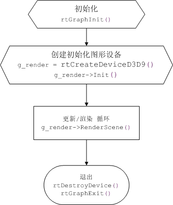
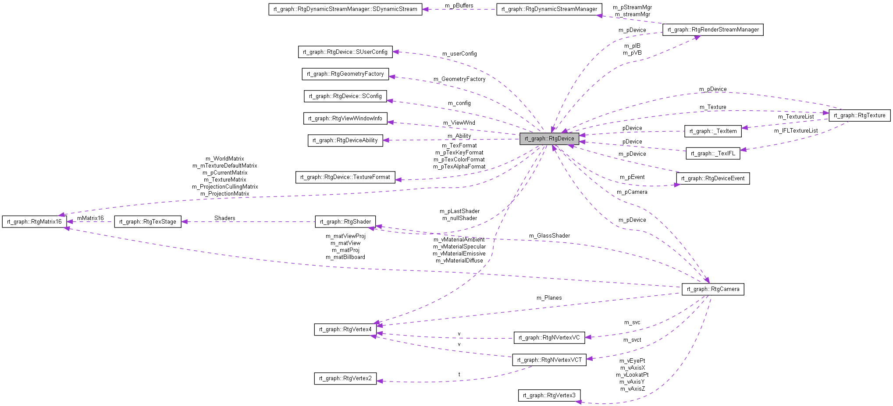

#### 引言

graph提供整个游戏引擎的底层图形支持，基于微软的direct3d 9.0c 3d API，封装了底层的3D API。



#### 主要功能模块

1）模型数据（RtgBuffer）：主要封装了vb（顶点缓冲）和ib（索引缓冲）

2）模型数据管理（RtgRenderStreamManager）：用来管理模型数据

3）摄像机（RtgCamera/RtgFrustum）：提供3d空间的镜头控制

4）灯光（RtgLight）：场景关照

5）碰撞检测模块（rtg_collision）：提供基本碰撞检测函数

6）配置模块（RtgConfig）：提供配置图形系统能力的接口

7）图形设备（RtgDevice/RtgDevice2D）: 3d 图形设备的抽象层

8）基础图元（RtgGeometryNode/RtgGeometryFactory/RtgGeometry）: 矩形，球体等基础图元的封装

9）图像/纹理（RtgImage/RtgTexture）：封装了各种格式的2d图像的读取，纹理管理

10）图形数学模块（rtg_math/RtgMatrix/RtgPlane/RtgVertex3/RtgTriangle）：提供基本的2d/3d数学函数和数据结构

11）渲染材质模块（RtgShader）：控制渲染3d模型的渲染着色

Device 是整个图形系统的中心,它也是对d3d设备的抽象和封装,以下是devcie和其他模块的关系图




#### 函数接口及类的说明

##### 1.全局接口

```c++
//初始化图形系统

bool rtGraphInit();

//创建d3d9图形设备

RtgDevice* rtCreateDeviceD3D9();

//销毁图形设备

void rtDestroyDevice(RtgDevice* pDevice);

//退出图形系统

void rtGraphExit();
```

#####  2.结构和类型

```c++
// 设备类型
enum RTGDeviceType
{
    RTG_DEVICE_D3D7,   // direct3d 7（丢弃）
    RTG_DEVICE_D3D8,   // direct3d 8（丢弃）
    RTG_DEVICE_D3D9,   // direct3d 9 
    RTG_DEVICE_OPENGL,// opengl （未支持）
};

// 显示模式
enum RTGViewWindowMode
{
    RTGVWM_WINDOWED = 0,  // 窗口模式
    RTGVWM_TOPWINDOW,    // 顶层窗口模式(假全屏,)
    RTGVWM_FULLSCREEN,    // 全屏幕模式
    RTGVWM_MAX
};

// 内存类型
enum RTGMemoryType
{
    RTG_SYSTEM_MEMORY,   // 系统内存
    RTG_VIDEO_MEMORY     // 显存
};
// 着色器
enum RTG_SHADER_ENUM
{
    RTG_MAX_MULTITEXTURES = 8,  // 最大支持贴图单元数
    RTG_MAXSHADERS         = 8, // 最大支持的着色器数量
};

// 数据缓冲类型
enum RTGBufferType
{
    RTGBT_VERTEX_BUFFER, // 顶点缓冲
    RTGBT_INDEX_BUFFER   // 索引缓冲
};

// 顶点格式
enum RTGVertexFormat
{
    RTGVF_NULL              = 0,          // 
    RTGVF_V                 = 0x0001,      // 位置坐标
    RTGVF_TV                = 0x0002,      // 转换后的位置坐标
    RTGVF_N                 = 0x0004,      // 法线
    RTGVF_C                 = 0x0008,      // 颜色1
    RTGVF_T1                = 0x0010,      // 纹理坐标1
    RTGVF_T2                = 0x0020,		// 纹理坐标2
    RTGVF_T3                = 0x0040,		// 纹理坐标3
    RTGVF_T4                = 0x0080,		// 纹理坐标4
    RTGVF_C2                = 0x0100,      // 颜色2


// 光照模型
enum RTGLightMode
{
    RTG_LIGHT_POINT,  // 点光源
    RTG_LIGHT_SPOT,   // 聚光灯（不支持）
    RTG_LIGHT_DIRECTION, // 方向光
    RTG_LIGHT_PARALLELPOINT, // （不支持）
    RTG_LIGHT_MAX
};

struct RtgLightItem : public RtgLight
{
    float           fDistance;  // 距离，表示和目标点的距离，用在GetRangeLights函数中，进行排序
    RtgLightItem*   pNext;      // 下一个灯光，通常用在计算顶点色的地方
};


// 硬件图元类型（详细说明可以查看d3d文档）
enum RTGPrimitive
{
    RTG_TRIANGLES = 0,   // 三角形
    RTG_TRIANGLE_FAN,  // 三角形扇 
    RTG_TRIANGLE_STRIP, // 三角形带
    RTG_LINES, // 线
    RTG_LINE_STRIP, // 线待
    RTG_POINTS // 点
};

// 填充模式
enum RTGFillMode
{
    RTG_FILLPOINT       = 1,// 点
    RTG_FILLWIREFRAME   = 2,// 线框
    RTG_FILLSOLID       = 3,// 实体
};

// 缓冲lock模式，查看d3d文档
enum RTGLock
{
    RTGLK_NONE           = 0,
    RTGLK_READONLY          ,
    RTGLK_DISCARD           ,
    RTGLK_NOOVERWRITE       ,
    RTGLK_NOSYSLOCK         ,
    RTGLK_MAX
};
  
// 图形系统支持的软件图元
enum RTGGeometryType
{
    RTGGT_RECTANGLE      = 0,   // 矩形，一个面片
    RTGGT_TRAPEZIA          ,   // 梯形
    RTGGT_BOX               ,   // Box
    RTGGT_CIRCLE            ,   // 圆形
    RTGGT_CONE              ,   // 锥形
    RTGGT_CYLINDER          ,   // 圆柱体
    RTGGT_SPHERE            ,   // 球体
    RTGGT_DONUT             ,   // 圆环圈
    RTGGT_MAX
};


// 图形系统渲染选项
enum RTGRenderMask
{
    RTGRM_BLENDOBJ_ONLY   = 1,  // 只渲染带Alpha的物件
    RTGRM_NOBLENDOBJ_ONLY = 2,  // 只渲染不带Alpha的物件
    RTGRM_ALL             = 3,  // 渲染所有的物件
};

// 读取的纹理格式
enum RTGTexBitType
{
    RTGTBT_AUTO         = 0,    // 自动选择
    RTGTBT_COLOR        = 1,    // 只有颜色数据
    RTGTBT_ALPHA        = 2,    // 有Alpha数据
    RTGTBT_COLORKEY     = 3,    // 有ColorKey数据(1位alpha)
    RTGTBT_DXT_AUTO     = 4,    // 是DXT文件，由文件自己决定
    RTGTBT_MAX
};

ps:其他未列举说明的枚举类型均为对d3d渲染状态和选项的再次封装，可以直接参考d3d文档

// 渲染窗口信息
struct RtgViewWindowInfo
{
    RTGViewWindowMode   eViewMode;      // 显示模式
    bool                bEnable;            // 这种类型的窗口是否有效
    bool                bResize;       // 当设置显示模式的时候是否根据当前值设置窗口大小
    bool                bTopwindow;        // 是否顶层窗口
    bool                bFullscreen;         // 是否全屏
    int                 iPosX;              // 左上角坐标x
    int                 iPosY;              // 左上角坐标y
    DWORD               dwWidth;        // 宽度
    DWORD               dwHeight;        // 高度
    DWORD               dwDepth;         // 位深
    DWORD               dwRefreshRate;    // 刷新率
    RTHWND              hWnd;            // 窗口句柄
    DWORD               dwWndStyle;       // windows窗口风格
};

    // 顶点描述（参考d3d说明文档）
struct RtgVertexSpec
{
    int iNumVertexSize;    // 顶点大小 iNumVertexSize =  iNumVertexCoords* sizeof(float);
    int iNumVertexCoords;  // 位置坐标数
    int iVertexOffset;       // 位置数据偏移量 
    int iNormalOffset;      // 法相数据偏移量
    int iColorOffset;        // 颜色数据偏移量
    int iTexOffset;          // 纹理坐标偏移量 
    int iNumTexCoords;     // 纹理坐标数
    int iTexCoordList[RTG_MAX_MULTITEXTURES]; // 纹理坐标
    int TexOffset[RTG_MAX_MULTITEXTURES];    // 纹理坐标偏移量 
};

// 设备能力，和硬件相关（显示卡）
struct RtgDeviceAbility
{
    // device ability
    int             bFullScreneAntialiasing;    // 全屏反锯齿

    // Texture ability
    int             iMaxTextureWidth;         // 最大贴图宽度
    int             iMaxTextureHeight;         // 最大贴图高度
    int             iMaxMultiTextures;          // 一次渲染最多的贴图层数
    int             iMaxTextureStages;          // 一次渲染最多的Stage数
    bool            bSquareTexture;             // 是否需要方形的贴图
    bool            bEnvBumpmap;             // 是否支持Bumpmap
    bool            bDynamicTextures;           // 是否支持动态贴图
    bool            bDot3ProductBumpmap;       // 是否支持Dot3ProductBumpmap
    bool            bTextureOpMultiplyAdd;       // 是否支持纹理mult add混合
    bool            bTextureAddressBorder;        // 是否支持纹理border寻址模式
    bool            bTextureAddressClamp;        // 是否支持纹理clamp寻址模式
    bool            bTextureAddressWrap;         // 是否支持纹理wrap寻址模式
    bool            bTextureMipmap;             // 是否支持纹理mipmap

    // vertex ability
    int             iMaxPrimitiveCount;         // 最多的三角形数
    int             iMaxVertexIndex;            // 最多的索引数
    int             iMaxStreams;                // 流数目最打值
    int             iMaxStreamStride;           // 流数据跨度最大值
    bool            bVertexBuffer;              // 是否支持VertexBuffer
    bool            bVertexShader;              // 是否支持VertexShader
    bool            bPixelShader;               // 是否支持PixelShader
};
// 渲染材质
struct RtgShader
{
    bool                bColorKey;       // 是否有颜色键
    bool                bTwoSide;        // 是否打开双面材质
    bool                bEnableBlendFunc; // 是否打开纹理混合
    bool                bEnableAlphaTest;  // 是否打开alpha测试
    RTGBlendFunc        eBlendSrcFunc;   // 纹理混合方式
    RTGBlendFunc        eBlendDstFunc;  
    DWORD               dwTextureFactor; // 纹理因子
    int                 iMapChannel;       // 无效
    int                 iFilter;             // 无效

    int iNumStage;                            // 纹理操作单元数
    RtgTexStage  Shaders[RTG_MAXSHADERS]; // 纹理单元操作信息，参考d3d对应说明

```

##### 3.模块和类

###### 3.1图形系统事件响应类

```c++
class RtgDeviceEvent : public RtObject
{
public:
// 设备创建前
virtual bool OnPreCreate3DDevice() 

// 设备创建后
virtual bool OnAfterCreate3DDevice() 

// 设备初始化时
virtual bool OnDeviceInit()  

// 设备摧毁时
virtual void OnDeviceClose()

// 设备回复和丢失时
virtual bool OnRestoreDevice() 
virtual bool OnInvalidateDevice() 

// 准备渲染时
virtual void OnBeginRender()

// 渲染时
virtual void OnRender()

// 渲染2d
virtual void OnRender2D()

// 结束渲染时
virtual void OnEndRender()

// 清空（设置）z缓冲时
virtual void OnClearZRender()

// 更新中
virtual void OnFrameMove(float fDifTime)

// 错误发生
virtual bool OnErrorMessage(const char* szMsg, int iType)
};


```

###### 3.2图形设备

```c++
class RtgDevice
{
public:
    
// 初始化
// pEventClass : 图形系统事件接收类， 参看 RtgDeviceEvent
// pCameraClass : 摄像机类,如 : RT_RUNTIME_CLASS(RtgCameraEditor)
// szGraphIni : 图形系统配置文件名
// szUserIni : 用户配置文件名字
    bool Init(RTHINSTANCE hInst, 
              RtRuntimeClass* pEventClass,
              RtRuntimeClass* pCameraClass,
              const char* szGraphIni, 
              const char* szUserIni);
	bool Init(RTHINSTANCE hInst, 
              RtRuntimeClass* pEventClass, 
              RtRuntimeClass* pCameraClass,
              RtIni* pGraphIni,
              RtIni* pUserIni);

// 如果用户自己要创建窗口，就需要设置这个属性 hWnd 为用户创建窗口句柄
	void SetCustomWndHandle(HWND hWnd); 

// 退出（摧毁）设备
    void Close();

// 客户端调用，游戏主循环，里面包括windows消息循环和更新/渲染场景等等
	int Run();

// 编辑器调用，更新、渲染场景
	virtual void RenderScene();

// iType 0 错误, 1 必须退出的错误
	virtual bool OnErrorMessage(const char* szMsg, int iType); 

// 响应渲染窗口大小改变
	virtual void OnWindowSizeChanged()=0;

// 参看 RtgDeviceEvent
	RtgDeviceEvent* GetEvent();

// 指定渲染窗口
	void BindViewWindow(RTGViewWindowMode eMode, RTHWND hWnd, bool bResize=true);

// 设置渲染窗口信息（格式）
	void SetViewWindowInfo(RTGViewWindowMode eMode, 
                           DWORD dwWidth, 
                           DWORD dwHeight, 
                           DWORD dwDepth, 
                           DWORD dwRefreshRate);

// 设置显示模式
	bool SetViewMode(RTGViewWindowMode eMode); 

// 处理windows消息
	virtual long DeviceMsgProc( RTHWND hWnd, UINT uMsg, UINT wParam, UINT lParam )=0;

// 准备/结束渲染场景
	virtual BOOL BeginScene()=0;
    virtual void EndScene()=0;

// 设置/获取渲染状态,关于渲染状态的理解可以参考d3d文档
	virtual BOOL SetRenderState(RTGRenderState eState, DWORD dwValue)=0;
    virtual DWORD GetRenderState(RTGRenderState eState)=0;

	BOOL GetBackBufferRenderTarget(DWORD dwRenderTarget, DWORD dwZStencil=0);
	virtual BOOL GetBackBufferRenderTarget(_TexItem* pRenderTarget,_TexItem* pZStencil=0)=0;
    
// 设置/恢复渲染目标
    // SetRenderTarget和ReSetDefaultRenderTarget必须成对使用，
// 也就是说调用SetRenderTarget之后一定要调用SetDefaultRenderTarget
	BOOL SetRenderTarget(DWORD dwRenderTarget,DWORD dwZStencil=0);
    virtual BOOL SetRenderTarget(_TexItem* pRenderTarget, _TexItem* pZStencil=0)=0;
	virtual BOOL RestoreRenderTarget();
// 恢复默认渲染目标，一般为创建设备的时候创建的默认渲染目标
    virtual BOOL ResetDefaultRenderTarget()=0;

// 清空（设置）渲染目标数据
// bStencil 是否清空模版缓冲
// bTarget 是否清空颜色缓冲
// bZBuffer 是否清空深度缓冲
    virtual BOOL ClearRenderTarget(bool bStencil=false,
                                   bool bTarget=true, 
                                   bool bZBuffer=true, 
                                   DWORD dwColor=0x00000000,
                                   float fNewZ=1.f, 
                                   DWORD dwStencil=0)=0;

// 把相机中的视矩阵和投影矩阵设置到设备
	void SetMatrixFromCamera();

// 锁定FPS
    virtual void LockFps(DWORD dwMillisecondPerFrame)=0;

// 设置灯光到设备
    virtual BOOL SetLight(int iIdx, RtgLight* pLight)=0;

// 绘制基本图元
    void DrawPoint   ( RtgVertex3&  vPos, DWORD *pColor=NULL );
    void DrawLine    ( RtgVertex3&  vStart, RtgVertex3 &vEnd, DWORD *pColor=NULL );
    void DrawAxis    ( RtgMatrix16& m16, float fLen );
    void DrawBox     ( RtgVertex3&  vHalfExt, RtgMatrix16& m16, DWORD *pColor=NULL );
    void DrawBox     ( RtgVertex3&  mMin, RtgVertex3& mMax, DWORD *pColor=NULL );
    void DrawTriangle( RtgVertex3&  v1, RtgVertex3& v2, RtgVertex3& v3, DWORD *pColor=NULL )

// 固定管线的顶点格式操作
    RTGVertexFormat GetVertexFormat();
    DWORD GetVertexStride();
    void SetVertexFormat(RTGVertexFormat eVF, const char* pVertexShader = NULL);
    virtual BOOL OnSetFVF() = 0;

// 设置/获取矩阵（世界，视，投影，纹理）
    virtual void SetMatrix(RTGMatrix eMode, RtgMatrix16 *pM16)=0;
    virtual void GetMatrix(RTGMatrix eMode, RtgMatrix16 *pM16)=0;


// 硬件图元绘制接口（参看d3d文档） 
    virtual BOOL DrawPrimitive(RTGPrimitive eType, void *pVertices, UINT dwVerticesCount, UINT dwPrimitiveCount=-1)=0;
    virtual BOOL DrawPrimitiveVB(RTGPrimitive eType, void *pVertices, UINT dwVertexStart, UINT dwVerticesCount, UINT dwPrimitiveCount)=0;
    virtual BOOL DrawPrimitiveVB(RTGPrimitive eType, UINT dwVertexStart, UINT dwVerticesCount, UINT dwPrimitiveCount)=0; // for vb mgr
    virtual BOOL DrawIndexPrimitive(RTGPrimitive eType, void *pVertices, UINT dwVerticesCount, void *pIndices, UINT dwIndicesCount, UINT dwPrimitiveCount=-1)=0;
    virtual BOOL DrawIndexPrimitiveVB(RTGPrimitive eType, void *pVertices, UINT dwVerticesCount, void *pIndices, UINT dwIndicesCount, UINT dwPrimitiveCount)=0;
    virtual BOOL DrawIndexPrimitiveVB(RTGPrimitive eType, void *pVertices, UINT dwVertexStart, UINT dwVerticesCount, void *pIndices, UINT dwIndexStart, UINT dwIndicesCount, UINT dwPrimitiveCount)=0;
    virtual BOOL DrawIndexPrimitiveVB(RTGPrimitive eType, UINT dwVertexStart, UINT dwVerticesCount, UINT dwIndexStart, UINT dwPrimitiveCount)=0;
    virtual BOOL SetStreamSource(UINT dwStreamNumber, void* pStreamData, UINT dwStride)=0;
    virtual BOOL SetIndices(void* pIndexData)=0;
// 顶点缓冲操作（其实就是对d3d提供的顶点缓冲操作的封装）
	virtual BOOL CreateVertexBuffer(UINT dwLength, void** ppVertexBuffer, DWORD dwUsage=0x08L)=0;
    virtual BOOL LockVertexBuffer(void* pVertexBuffer, void** ppData, DWORD dwOffset=0, DWORD dwSize=0, RTGLock eLockFlag=RTGLK_DISCARD)=0;
    virtual BOOL UnLockVertexBuffer(void* pVertexBuffer)=0;
    virtual BOOL ReleaseVertexBuffer(void* pVertexBuffer)=0;

// 索引缓冲操作（其实就是对d3d提供的索引缓冲操作的封装）
    virtual BOOL CreateIndexBuffer(UINT dwLength, void** ppIndexBuffer, DWORD dwUsage=0x08L)=0;
    virtual BOOL LockIndexBuffer(void* pIndexBuffer, void** ppData, DWORD dwOffset=0, DWORD dwSize=0, RTGLock eLockFlag=RTGLK_DISCARD)=0;
    virtual BOOL UnLockIndexBuffer(void* pIndexBuffer)=0;
    virtual BOOL ReleaseIndexBuffer(void* pIndexBuffer)=0;
            void SetVertexBufferStart(DWORD dwOffset) { m_dwVertexBufferStartOffset = dwOffset; }
            void SetIndexBufferStart(DWORD dwOffset)  { m_dwIndexBufferStartOffset = dwOffset; }


// 材质相关
// 设置材质（漫反射，环境光，高光，自发光，高光强度）
	virtual BOOL SetMaterial(RtgVertex4& vDiffuse, 
                             RtgVertex4& vAmbient,
                             RtgVertex4& vSpecular,
                             RtgVertex4& vEmissive, 
                             float fPower=0.f)=0;
// 设置默认材质，颜色均为灰度值
	BOOL SetDefaultMaterial(float fR=1.f, float fG=1.f, float fB=1.f, float fA=1.f);
// 设置高光的强度
    BOOL SetHighlightPower(float fPower=0.f);


// 纹理操作
// 设置贴图格式（16位或者32位）
	virtual BOOL SelectTextureFormat(int iBits)=0;
// 纹理过滤相关，参看d3d文档
    virtual void SetTextureFilterMip(RTGTextureFilter eType)=0;
    virtual void SetTextureFilterMin(RTGTextureFilter eType)=0;
    virtual void SetTextureFilterMag(RTGTextureFilter eType)=0;
	virtual void SetTextureAddress(RTGTextureAddress eType)=0;
// 设置纹理边框颜色
	virtual void SetTextureBorderColor(DWORD dwColor)=0;

// 设置/恢复/删除渲染材质信息，主要是纹理混合模式和参数，参看RtgShader结构
    virtual void SetShader(RtgShader* pShader)=0;
    virtual void RestoreShader(RtgShader* pShader)=0;
    virtual void DeleteShader(RtgShader* pShader)=0;

// 模糊制定的纹理
	void Blur(DWORD Tex);
// 灰度化指定的纹理
    void Gray(DWORD Tex, bool bFirst);

private: // 以下函数只提供给类RtgTexture 使用，要使用类似功能，请调用m_Texture.function()
// 纹理创建系列函数
    virtual BOOL CreateTextureByFile(_TexItem* pItem, const char* szTexFileName, int iMipMap=0)=0;
    virtual BOOL CreateTextureByImage(_TexItem* pItem, RtgImage& img)=0;
    virtual BOOL CreateTextureDynamic(_TexItem* pItem)=0;
    virtual BOOL CreateTextureRenderTarget(_TexItem* pItem)=0;
    virtual BOOL CreateTextureDepthStencil(_TexItem* pItem)=0;
	virtual BOOL CreateTextureByMemoryCpy(_TexItem* pItem)=0;

// 删除纹理
	virtual BOOL DeleteTexture(_TexItem* pItem)=0;

// 使用纹理到相应的纹理单元
	virtual BOOL UseTexture(int iTextureStage, _TexItem* pItem)=0;


// 更新（修改）纹理
    virtual BOOL UpdateTexture(_TexItem* pItem, void *pBuffer)=0;
	virtual BOOL UpdateTextureDynamic(_TexItem* pItem, void *pBuffer)=0;

// 设置/获取纹理矩阵
    virtual void SetTextureMatrix(int iIdx, RtgMatrix16 *pM16)=0;
	virtual void GetTextureMatrix(int iIdx, RtgMatrix16 *pM16)=0;

// 锁定/撤销锁定纹理（纹理要锁定后才可以修改）
    virtual BOOL TextureLock(_TexItem* pItem, RtgTexture::TexLock& texLock)=0;
    virtual void TextureUnlock(_TexItem* pItem, RtgTexture::TexLock& texLock)=0;
protected:

// 切换到全屏显示模式
	virtual bool FullscreenToggle()=0;	

// 设置全屏显示参数
	virtual bool SetFullScreenInfo(DWORD dwWidth, DWORD dwHeight, DWORD dwDepth)=0;

// 重设设备（当发生设备丢失和恢复是需要重设设备）
    virtual bool ResetDevice(BOOL bFullscreen, DWORD dwWidth, DWORD dwHeight, DWORD dwDepth)=0;

// 雾相关
public:
// 开启，关闭雾效
	virtual void SetFogEnable(BOOL bEnable)=0;                           
	virtual void SetFogParameter(DWORD dwColor, float fNear, float fFar)=0; // 设置雾的颜色，最近最远值
    virtual void SetFogColor(DWORD dwColor)=0;                            // 设置雾的颜色
    virtual void SetFogNear(float fNear)=0;                                 // 设置雾的最近值
    virtual void SetFogFar(float fFar)=0;                                   // 设置雾的最远值
    virtual BOOL GetFogEnable() { return m_bFogEnable;}                     // 取得雾的开关
    virtual DWORD GetFogColor() { return m_dwFogColor;}                   // 取得雾的颜色
    virtual float GetFogNear()  { return m_fFogStart;}                      // 取得雾的最近值
    virtual float GetFogFar()   { return m_fFogEnd;}                        // 取得雾的最远值

// 状态块操作相关，关于状态块开业参考d3d文档的相关讲解
	// 创建ui使用的状态块
    virtual bool CreateUIStateBlock(DWORD* dwToken)=0;
    // 开始记录状态
    virtual bool BeginRecordStateBlock()=0;
    // 结束记录
    virtual bool EndRecordStateBlock(DWORD* dwToken)=0;
    // 删除状态块
    virtual bool DeleteStateBlock(DWORD dwToken)=0;
    // 使用状态块
    virtual bool ApplyStateBlock(DWORD dwToken)=0;
	// 捕获状态
    virtual bool CaptureStateBlock(DWORD dwToken)=0;

    // 设置图形系统使用的相机
    void SetCamera(RtgCamera* pCamera);

    // 设置图形系统事件相应者，参看 RtgDeviceEvent
    void SetEvent(RtgDeviceEvent* pEvent);

// 绘制文字
    virtual void DrawString(float fX, float fY, DWORD dwColor, const char* pString, DWORD dwFlags=0)=0;

// 获取纹理可用内存大小（一般是物理显存+AGP）
	virtual int GetAvailableTextureMem();

// 把当前渲染画面保存到文件（截屏）
    virtual BOOL SaveRenderTargetToFile(const char* szFileName, bool bJPG=true); // bJPG=false就存成BMP
    virtual BOOL SaveRenderTargetToArchive(RtArchive* pArc, bool bJPG=true); // bJPG=false就存成BMP

// 是否是窗口模式
    virtual BOOL IsWindowed()=0;

// 是否得到焦点
	virtual BOOL HasFocus()=0;

// 是否处于激活状态
	virtual BOOL IsActive()=0;

// 获取渲染窗口信息
    RTGViewWindowMode GetViewWindowMode()   { return m_eCurrentViewWindowMode; }
    const RtgViewWindowInfo& GetViewWindowInfo(RTGViewWindowMode eMode)    { return m_ViewWnd[eMode]; }
    virtual void UpdateAppTime()=0; // 更新状态信息，FPS等
    virtual float GetElapsedTime()=0; // 返回离上一次调用Render和FrameMove的时间差(秒)
    virtual float GetAppTime()=0;     // 返回程序执行的时间(秒)

// 后处理相关
// 当前这套图形引擎只支持FFP，不支持PP，所以所有后处理都是软件处理的，没有
// 利用硬件加速，目前后处理种类也非常简单，只有blur和gray
    void SetPostProcessEffectOnoff(bool bOn)          { m_bUsePostProcessEffectOnoff = bOn; }
    bool IsUsePostProcessEffectOn()                   { return m_bUsePostProcessEffectOnoff; }

    void UsePostProcessEffect(bool bUse)            { m_bUsePostProcessEffect = bUse; }
	bool IsUsePostProcessEffect()                   { return m_bUsePostProcessEffect; }

// 通过世界坐标计算得到屏幕坐标
    void GetScreenPos(RtgVertex3 &vWorldPos, int &nOutX, int &nOutY);
	void GetScreenPos(RtgVertex3 &vWorldPos, int &nOutX, int &nOutY, float &nOutZ);

// 通过屏幕坐标得到投射线（拣选操作）
    void GetPickRayFromScreen(int sx, int sy, RtgVertex3 &vOrig, RtgVertex3 &vDir);

    // 取得显示模式, 返回总共可以取得的数量
    //     如果pModeBuf传入指针为空，就可以通过返回值取得Buf的大小,
    //     iBufSize限制Buffer的大小，如果为表示不限制大小
virtual DWORD GetDisplayMode(RtgDisplayMode* pModeBuf, DWORD dwBufSize=0)=0;

    // 是否能有窗口模式
    virtual bool GetCanDoWindowed()=0;
    // 设备描述
    virtual const char* GetDeviceDesc()=0;

protected:
// 配置相关，图形系统配置信息和用户配置信息可能有相同的配置项，在这种情况下
// 使用用户配置信息，也就是说用户配置优于图形系统配置

// 读取图形系统配置信息
void ReadGraphIni(RtIni* pGraphIni);

// 读取用户配置信息
void ReadUserIni(RtIni* pUserIni);

// 应用当前配置
void ApplyConfig();

public:
    RTGDeviceType       m_eDeviceType;          // 设备类型
    BOOL                m_bDeviceReady;         // 当前驱动是否已经准备好

    RtgCamera*          m_pCamera;              // 系统默认的Camera
    RtgTexture          m_Texture;              // 贴图管理
    RtgDeviceAbility    m_Ability;              // 能力
    RtgGeometryFactory  m_GeometryFactory;      // 几何图形生成器

    RtgRenderStreamManager* m_pVB;              // Vertex Buffer 管理
    RtgRenderStreamManager* m_pIB;              // Index Buffer 管理

    // Display mode
    int                 m_iWndWidth;            // 屏幕宽度
    int                 m_iWndHeight;           // 屏幕高度
    int                 m_iWndColorBits;        // 颜色深度
    RTGTextureFormat    m_eBackbufferFormat;    // backbuffer格式
    DWORD               m_dwRefreshRate;        // 屏幕刷新率

    // cull face
    BOOL                m_bLeftHanded;          // 是否是左手坐标系
    BOOL                m_bCullFace;            // 是否使用可视面检查
    DWORD               m_dwCullDefault;        // 默认的面检查

    // render device
    //RtgVertexSpec       m_VertexSpec;         // 最后的顶点属性
    RTGVertexFormat     m_eVertexFormat;        // 最后的顶点属性
    DWORD               m_dwVertexFVF;          // 最后一次使用的FVF
    DWORD               m_dwVertexStride;       // 最后一次使用的顶点格式的大小
    BOOL                m_bVertexProcessing;    // 是否用软件处理顶点(VS)

    // lighting
    BOOL                m_bLighting;            // 是否使用灯光
    BOOL                m_bLight[8];            // 使用的灯光

    // alpha state
    BOOL                m_bAlphaTest;           // 是否使用AlphaTest
    int                 m_iAlphaRef;            // AlphaTest参数
    RTGAlphaFunc        m_eAlphaFunc;           // AlphaTest函数

    // blend state
    BOOL                m_bBlend;               // 是否使用混合
    RTGBlendFunc        m_eBlendSrcFunc;        // 混合方式 
    RTGBlendFunc        m_eBlendDestFunc;       //
    DWORD               m_dwTextureFactor;      // 纹理因子

    // Shader
    RtgShader*          m_pLastShader;          // 最后一个Shader
    RtgShader           m_nullShader;           // 空的Shader

   // 深度
    BOOL                m_bZTest;              // 是否使用深度检查
    BOOL                m_bZWrite;				// 是否使用深度写 
    RTGDepthFunc        m_eZFunc;              // 深度比较函数

    // 材质
    RtgVertex4          m_vMaterialDiffuse;         // 漫反射
    RtgVertex4          m_vMaterialAmbient;		// 环境光
    RtgVertex4          m_vMaterialSpecular;		// 高光
    RtgVertex4          m_vMaterialEmissive;		// 自发光
    float               m_fMaterialPower;			// 高光强度

    // texture state
    BOOL                m_bTexture[8];            // 是否使用贴图
    BOOL                m_bUseTextureMatrix[8];   // 是否使用贴图Matrix
    long                m_dwTexTransformFlag[8];   // 贴图矩阵类型
    RtgMatrix16         m_mTextureDefaultMatrix;  // 贴图的默认矩阵
    RTGTextureFilter    m_eTextureFilterMip;      // MipMap层之间的过滤
    RTGTextureFilter    m_eTextureFilterMin;      // 贴图缩小的过滤
    RTGTextureFilter    m_eTextureFilterMag;      // 贴图放大的过滤
    DWORD               m_dwTextureBorderColor;   // 贴图边缘颜色，只有在贴图寻址方式为RTGTADD_BORDER时有效
    int                 m_iTextureCurrentID;      // 当前使用的贴图ID
    RTGTextureAddress   m_eTextureAddress;        // 贴图寻址方式
    int                 m_iTextureCurPass;        // 当前的贴图通道
    int                 m_iTextureRequiredPasses; // 需要Draw的次数
    RTGTextureBlendMode m_eTextureBlendMode[RTG_MAX_MULTITEXTURES];
    RTGTextureCoordMode m_eTextureCoordMode[RTG_MAX_MULTITEXTURES];

    
    RTGFillMode         m_eFillMode;            // 填充模式点、线框、实体
    BOOL                m_bEnableViewCheck;     // 是否进行可见检查
    BOOL                m_bClearZRender;        // 是否清除Z缓冲区后调用OnClearZRender函数(通常用在编辑器)

    // 矩阵相关
    RTGMatrix           m_eMatrixMode;      // 矩阵类型
    RtgMatrix16         m_WorldMatrix;		// 世界矩阵
    RtgMatrix16         m_ProjectionMatrix;	// 投影矩阵
    RtgMatrix16         m_ProjectionCullingMatrix;	// 投影裁剪矩阵
    RtgMatrix16         m_TextureMatrix[8];		// 纹理矩阵
    RtgMatrix16 *       m_pCurrentMatrix;		// 当前使用矩阵

    // Color
    unsigned long       m_dwClearColor;         // 清除背景的颜色
    unsigned long       m_dwCurrentColor;       // 当前保存的颜色

    int                 m_iPostProcessEffectType;       // 0 默认, 1 黑白
    float               m_fPostProcessEffectContrast;   // 后期处理对比度
    float               m_fPostProcessEffectIntensity;  // 后期处理强度


protected:
    BOOL                m_bFogEnable;           // 是否使用雾
    unsigned int        m_dwFogColor;				  // 雾颜色
    float               m_fFogStart;					// 雾开始距离
    float               m_fFogEnd;					// 雾结束距离
    DWORD               m_dwVertexBufferStartOffset;	// 当前顶点数据偏移量
    DWORD               m_dwIndexBufferStartOffset;	// 当前索引数据偏移量

    bool                m_bUsePostProcessEffect;		// 是否使用后处理

public:
// 用户配置结果
    struct SUserConfig
    {
        // Graph
        bool    bFullscreen;        // 全屏模式
        bool    bFSAA;            // 全屏抗锯齿
        bool    bEdgeAntialias;     // 边缘抗锯齿
        bool    bEnableConsole;    // 是否还是用控制台
        long    lWndWidth;		 // 显示窗口宽 
        long    lWndHeight;		// 显示窗口长
        long    lWndColorDepth;	// 颜色深度(16或32)
        bool    bPosteffect;        // 后期处理 
        bool    bObjEffect;         // 后期加强
        DWORD   dwMaxMultiSampleTypeWindowed;  // 窗口模式时的AA类型
        DWORD   dwMaxMultiSampleTypeFullscreen;	  // 全屏模式时的AA类型
        long    lMillisecondPerFrame;

        // 质量
        long    lTextureQuality;    // 贴图质量  高(贴图质量等级0 最高, 1 其次, 2 再次)
        long    lGeometryQuality;   // 几何质量  高(几何图形质量等级0 最高, 1 其次, 2 再次)
    };
    struct SConfig
    {

        int     iDefaultStartX;     // 开始窗口的X位置，默认为-1
        int     iDefaultStartY;     // 开始窗口的Y位置，默认为-1
        char    szWindowTitle[256]; // 窗口标题
        HWND    hCustomWndHandle; // 控制台窗口句柄

     	// 相机
        float fCameraFOV;	// 视角
        float fCameraAspect; // 横纵比
        float fCameraNear;	// 近视距
        float fCameraFar;	// 远视距
        bool  bEnableFog;// 是否开启雾效
    };
    SUserConfig m_userConfig; // 用户配置信息
    SConfig     m_config;		// 图形系统配置信息

public:
// 纹理格式
    struct TextureFormat
    {
	    RTGTextureFormat    m_eFormat;
	    int		            m_bSupported;
	    int		            m_iBits;
	    int		            m_iAlphaBits, m_iRBits, m_iGBits, m_iBBits;
	    void (*fill)(int width, int height, void *dest, int destpitch, void *src, int srcpitch);
    };
    enum { MAX_TEXTUREFORMATS = 32 };
    int             m_iTexNumBits;      // 贴图的图形格式
	int             m_iTexNumFormats;
	TextureFormat   m_TexFormat[MAX_TEXTUREFORMATS];
	TextureFormat*  m_pTexAlphaFormat;  // 包含颜色和Alpha的格式
	TextureFormat*  m_pTexColorFormat;  // 只包含颜色没有Alpha的格式
    TextureFormat*  m_pTexKeyFormat;    // 包含颜色和位Alpha的格式

public:
    // 时间(Time)
    float           m_fDesireFPS;           // 希望得到的帧数，如果得到了就会Sleep

public:
    // 统计(STAT.)
    int             m_iLastRenderNumFaces;      // 最后一次渲染的面数
    int             m_iLastRenderNumClusters;   // 最后一次渲染的次数
    int             m_iLastRenderUseTexture;		// 最后一次使用的纹理数

protected:
RtgDeviceEvent* m_pEvent;   // 事件接收器

// 事件相应
    virtual bool OnPreCreate3DDevice();
    virtual bool OnAfterCreate3DDevice();
    virtual bool OnInit();
    virtual void OnClose();
    virtual bool OnRestoreDevice();
    virtual bool OnInvalidateDevice();
    virtual void OnBeginRender();
    virtual void OnRender();
	virtual void OnRender2D();
    virtual void OnEndRender();
    virtual void OnClearZRender();

    // 时间为相距上一次调用本函数的时间(秒)，要取得应用程序执行时间请调用函数GetElapsedTime
    virtual void OnFrameMove(float fDifTime);

    virtual bool OnCreate3DDevice()=0;
    virtual int  OnRun()=0;

};

由RtgDevice派生了d3d设备类,主要针对d3d(目前本图形系统只支持d3d)
class RtgDeviceD3D9 : public RtgDevice
还有一个class CD3DApplication类,用于d3d设备辅助
rtg_enum_mapping.h 中进行了本图形系统和d3d的渲染状态映射

```

###### 3.3 数据缓冲

class RtgBuffer

{

public:

    RtgBuffer();

    ~RtgBuffer();

 

// 获取缓冲存储类型（系统内存或者物理显存）

    RTGMemoryType GetMemoryType(void) { return m_eMType; }

 

// 获取缓冲区类型（顶点缓冲或者索引缓冲）

    RTGBufferType GetBufferType(void) { return m_eVType; }

 

// 设置顶点缓冲格式（位置坐标维度，是否有法线，是否有颜色，纹理坐标数，纹理坐标）

    int SetVertexFormat(int vsize, int normal, int color, int numtex, int *texcoords = NULL);

    // 设置顶点缓冲格式

void SetVertexFormat(RTGVertexFormat fmt);

    void SetVertexFormat(RtgVertexSpec fmt);

 

// 设置缓冲类型和储存类型

    void SetResourceType(RTGMemoryType mtype, RTGBufferType vtype);

 

// 分配esize个单元

    void *AllocateElements(RtgDevice* pDevice, int esize);

 

// 分配size大小的缓冲区

    void *AllocateBuffer(RtgDevice* pDevice, int size);

 

// 释放

    int ReleaseBuffer(RtgDevice* pDevice);

 

// 锁定/解锁（锁定了才可以修改）

    void *LockBuffer(RtgDevice* pDevice);

    int UnLockBuffer(RtgDevice* pDevice);

 

// 获取缓冲区数据指针

    void *GetBuffer(void) { return m_pBuffer; }

 

// 修改/获取顶点位置

    int SetVertex(int index, RtgVertex3 &vertex);

    int SetVertex(int index, float x, float y, float z);

    int GetVertex(int index, RtgVertex3 &vertex);

    RtgVertex3 *GetVertex(int index);

 

// 修改/获取顶点法线

    int SetNormal(int index, RtgVertex3 &normal);

    int SetNormal(int index, float x, float y, float z);

    int GetNormal(int index, RtgVertex3 &normal);

    RtgVertex3 *GetNormal(int index);

 

// 修改/获取顶点颜色

    int SetColor(int index, int color);

    int SetColor(int index, float r, float g, float b, float a=1.0f);

    void *GetColor(int index);

 

// 修改/获取顶点纹理坐标

    int SetTexCoord(int index, float *coord);

    int SetTexCoord(int index, float x, float y, int channel = -1);

    int SetTexCoord(int index, float x, float y, float z, int channel = -1);

    int GetTexCoord(int index, float &s, float &t, int channel = 0);

    void *GetTexCoord(int index);

 

// 修改/获取顶点索引

    int SetIndex(int index, int value);

    int GetIndex(int index, int &value);

 

// 获取顶点格式描述

    RtgVertexSpec GetVertexFormat(void) { return m_VertexSpec; }

 

protected:

  RtgDevice*   m_pDevice;

    RTGMemoryType  m_eMType;

    RTGBufferType  m_eVType;

    void      *m_pBuffer;

    unsigned char  *m_pLockedBuffer;

    RtgVertexSpec  m_VertexSpec;

    int       m_iNumElements;

};


// 动态流管理器(管理若干缓冲区,每个缓冲区分成若干的块进行管理)

class GRAPH_API RtgDynamicStreamManager

{

public:

  friend class RtgRenderStreamManager;

  struct SDynamicStream

  {

    DWORD    dwTotalSize;  // 这个Buffer的内存大小

    DWORD    dwFreeSize;   // 剩下没有使用的空间的大小

    DWORD    dwActiveEntry; // 在这个空间中有多少块 (只是统计用)

  };

 

public:

  SDynamicStream*   m_pBuffers;     // 缓冲区


  DWORD        m_dwTotalStream;   // 总共的缓冲区数

  DWORD        m_dwTotalMemory;  // 总共内存大小

  DWORD        m_dwUsedMemory;  // 总共使用内存大小

  DWORD        m_dwActiveEntry;  // 总共块数

  DWORD        m_dwLastestStream; // 最后一次使用缓冲区索引

 

public:

 

// 初始化(缓冲区数,缓冲区大小)

    void InitStreamManager(DWORD dwTotalStream, DWORD* pdwSize);


// 查询是否有合适大小的块

BOOL QuerySpace(DWORD dwInSize, DWORD& dwOutBufferID, DWORD& dwOutOffset);


// 清空一个缓冲区

DWORD ClearOneBuffer();


// 清空一个合适大小的缓冲区

DWORD ClearSizeBuffer(DWORD dwMinSize);


// 清空所有缓冲区

  void ClearAllBuffer();


// 获取缓冲区

  SDynamicStream* GetBuffer(DWORD dwBufferID);


   // 加入一个块,返回False表示没有加进去, 否则是成功

  BOOL AddEntry(DWORD dwBufferID, DWORD dwSize, DWORD& dwInOutOffset, DWORD dwStride);

};


// 图形系统渲染数据流管理器

// 一个RtgBuffer是一块缓冲数据,里面储存着顶点数据或者索引数据

// RtgDynamicStreamManager用来管理一些列的RtgBuffer

// RtgRenderStreamManager进一步对RtgDynamicStreamManager进行封装,

// 提供lock修改缓冲区的功能

// 整个图形系统有两个RtgRenderStreamManager,分别用来管理所有的顶点缓冲和索引缓冲
 

class GRAPH_API RtgRenderStreamManager

{

public:

  RtgRenderStreamManager(RtgDevice* pDevice);

  virtual ~RtgRenderStreamManager();

 

// 初始化(缓冲区数量,大小,其他参数无效)

// 目前所有缓冲区均为RtgDynamicStreamManager,没有所谓的static stream

  BOOL InitStreamManager(DWORD nTotalDynamicStream, DWORD* nDynamicSize, DWORD nTotalStaticStream, DWORD* nStaticSize, DWORD nTotalDynamicEntry, DWORD nTotalStaticEntry);

   // 开始上传数据

  // wResID   为资源的ID

  //   dwSize   为资源的大小(单位是字节)

  //   bResident  是否驻留显存, 如果是则会返回dwResID, 如果不驻留则后面调用Bind的时候传入(0, 0)就可以

  //   dwStride  每个顶点(索引)的大小(单位是字节)

  //   返回一个指针，你可以对这个指针写入数据

void* BeginUpload(DWORD& dwResID, DWORD dwSize, BOOL bResident, DWORD dwStride);

 
// 结束上传数据

BOOL EndUpload(DWORD& dwResID);

 

// 上传数据(对BeginUpload和EndUpload的封装而已)

  BOOL Upload(DWORD& dwResID, BYTE* pResource, DWORD dwSize, BOOL bResident, DWORD dwStride);

 

// 清空指定缓冲区

  void Clear(DWORD dwResID);

  

// 清空所有缓冲区

void ClearAll();

 
  void OnBeginRender();

  void OnEndRender();

 

  // 把资源绑定给设备，对于VB和IB，这两个参数有不同的解释

  // VertexBuffer

  //   dwChannel  数据流编号，通常传0

  //   dwResID   资源编号

  // IndexBuffer

  //   dwChannel  VertexBuffer的资源编号

  //   dwResID   资源编号

  // 返回值表示是否成功

  // 如果前面Upload的是动态缓冲(bResident=FALSE)，那么这里可以都传入0 (即 Bind(0, 0))

  virtual BOOL Bind(DWORD dwChannel, DWORD dwResID) = 0;

 

protected:

// 锁定缓冲区(只有锁定了才可以修改)

virtual void* LockStream(DWORD dwBufferID, DWORD dwOffset, DWORD dwSize, DWORD bDiscard)=0;

// 解锁

  virtual BOOL UnlockStream(DWORD dwBufferID)=0;


protected:

};


// 图形系统的顶点缓冲管理器

class GRAPH_API D3DVertexStreamManager : public RtgRenderStreamManager

 

// 图形系统的索引缓冲管理器

class GRAPH_API D3DIndexStreamManager : public RtgRenderStreamManager

 

###### 3.4 摄像机

class RtgCamera : public RtObject

{

public:


public:

  RtgVertex3 m_vEyePt;    // 镜头(眼睛)位置

  RtgVertex3 m_vLookatPt;  // 目标(观察点)位置

  RtgVertex3 m_vAxisY;    // 镜头上方向

  RtgVertex3 m_vAxisX;    // 镜头右方向

  RtgVertex3 m_vAxisZ;    // 镜头前方向

  RtgVertex4 m_Planes[6];   // 视锥面

 

  RtgMatrix16 m_matView;   // 视矩阵

  RtgMatrix16 m_matBillboard;  // 公告板矩阵

 

  float    m_fFOV;     // 视角

  float    m_fAspect;    // 横纵比

  float    m_fNearPlane;  // 近截面

  float    m_fFarPlane;   // 远截面

  RtgMatrix16 m_matProj;   // 投影矩阵

  RtgMatrix16 m_matViewProj; // 视投影矩阵

  float    m_fLeft;

  float    m_fRight;

  float    m_fBottom;

  float    m_fTop;


  int     m_bUpdate;    // 是否需要更新

  int     m_bOrtho;    // 是否是正交投影

 

public:


// 镜头参数设置/获取

   RtgVertex3 GetEyePt()      { return m_vEyePt; }

  RtgVertex3 GetUpVec()      { return m_vAxisY; }

  RtgVertex3 GetLookatPt()     { return m_vLookatPt; }

  RtgVertex3 GetViewDir()     { RtgVertex3 v(m_vAxisZ); v.Negative(); return v; }

  RtgVertex3 GetCross()      { return m_vAxisX; }

  float   GetFOV()       { return m_fFOV; }

  float   GetAspect()      { return m_fAspect; }

  float   GetNearPlane()    { return m_fNearPlane; }

  float   GetFarPlane()     { return m_fFarPlane; }

  void   SetFOV(float f)    { m_fFOV = f; }

  void   SetAspect(float f)  { m_fAspect = f; }

  void   SetNearPlane(float f) { m_fNearPlane = f; }

  void   SetFarPlane(float f) { m_fFarPlane = f; }

  RtgMatrix16 GetViewMatrix()   { return m_matView; }

  RtgMatrix16 GetBillboardMatrix() { return m_matBillboard; }

  RtgMatrix16 GetProjMatrix()   { return m_matProj; }


  void ReUpdate();

  void Identity(void);

  void SetViewParams( float fx, float fy, float fz, float cx, float cy, float cz, float ux, float uy, float uz );

  void SetViewParams( RtgVertex3 &vEyePt, RtgVertex3 &vLookatPt, RtgVertex3 &vUpVec );

  void SetProjParams( float fFOV, float fAspect, float fNearPlane, float fFarPlane );

  void SetOrthoParams(float fLeft, float fTop, float fRight, float fBottom, float fNearPlane, float fFarPlane);

  void SetViewMatrix(RtgMatrix16& m16);

  void SetMatrix(RtgMatrix16& ma);

    void UpdateMatrix(void);

 

  /** 取得眼睛所在位置和方向.

  \* 注意：不能通过GetEyePt取得眼睛所在位置，只能通过这个函数才能取得当前摄像机的眼睛所在位置

  */

  void GetEyeInfo(RtgVertex3& eyePos, RtgVertex3& eyeDir);

 

void RestoreDevice();

// 切换投影模式(正交,透视)

void ToggleProjectType();


// 设置投影模式

void SetProjectType(BOOL bPerspective);

 

// 是否使用透视投影

  bool IsPerspective()            { return m_bOrtho==0; }

 

  void AddPitch(float amount);  // 倾斜

  void AddYaw(float amount);  // 偏移

  void AddRoll(float amount);  // 滚动

  void MoveForward(float fAmount); // 前进

  void MoveRight(float fAmount); // 右移

  void MoveUp(float fAmount);  // 上移

  void SetPitch(float fValue);

  void SetYaw(float fValue);

  void SetRoll(float fValue);

  void SetForward(float fValue);

  void SetRight(float fValue);

  void SetUp(float fValue);

  void SetPosition(RtgVertex3 &vPos);

 

// 更新视锥面

  void UpdateFrustrumClipPlanes();

// 相交检测

  bool ViewCheckAABB(const RtgVertex3 &min, const RtgVertex3 &max); // AABB View check

  bool ViewCheckPoint(float x, float y, float z);

  bool ViewCheckSphere(float x, float y, float z, float fRadius);

  bool ViewCheckBound(const RtgAABB &aabb, const RtgMatrix16 &m16);

// 把当前状态写入缓冲

virtual int SaveToBuffer(char* szBuffer){return 0;}

// 从缓冲读取

  virtual int LoadFromBuffer(char* szBuffer){return 0;}

protected:

// 相机状态改变响应

  virtual void OnSetViewParams();

  virtual void OnSetProjParams();

  virtual void OnUpdateMatrix();

  virtual BOOL OnAddPitch(float amount)    {return FALSE;}

  virtual BOOL OnAddYaw(float amount)     {return FALSE;}

  virtual BOOL OnAddRoll(float amount)    {return FALSE;}

  virtual BOOL OnMoveForward(float fAmount)  {return FALSE;}

  virtual BOOL OnMoveRight(float fAmount)   {return FALSE;}

  virtual BOOL OnMoveUp(float fAmount)    {return FALSE;}

  virtual BOOL OnSetPitch(float fValue)    {return FALSE;}

  virtual BOOL OnSetYaw(float fValue)     {return FALSE;}

  virtual BOOL OnSetRoll(float fValue)    {return FALSE;}

  virtual BOOL OnSetForward(float fValue)   {return FALSE;}

  virtual BOOL OnSetRight(float fValue)    {return FALSE;}

  virtual BOOL OnSetUp(float fValue)     {return FALSE;}

  virtual BOOL OnSetPosition(RtgVertex3 &vPos){return FALSE;}

public:

// 镜头震动

// 振动, fScope幅度, fTime时间(秒)

void Tremble(float fScope=20.f, float fCycle=0.3f, float fTime=0.6f);

// 镜头贴花

  void SetColoredGlass(EGlassType eType=COLOR_ADD, DWORD dwColor=0xFFFFFFFF, const char* szFilename=NULL, float fTimeIn=0.05, float fTimeOut=0.2f, float fAlphaMax=1.f, float fAlphaMin=0.f);

  virtual void Render(float fDifSecond);

};

###### 3.5 碰撞检测辅助

相关文件 rtg_collision.h

//   AABB ( Axis-Aligned Bounding Box ) 与坐标轴平行的Bounding Box

//   AABB[6] -> x0, y0, z0, x1, y1, z1

//   OBB ( Oriented Bounding Box )

//   basis : u, v, w axes 分别是x,y,z的坐标

//   extents: extents ( half-length) in u, v, w

//   pos  : center position 中间位置

// 2D

//   顶点是否在矩形内部 rtg2DIsVertexIntersectRectangle

//   两条线段是否相交  rtg2DIsLineIntersectLine

//   线段是否与矩形相交 rtg2DIsLineIntersectRectangle

//   点到直线的距离   rtg2DPoint2LineDistance     根据参数可以选择是到线段还是直线的距离

// 3D

//   顶点是否在AABB内部 rtgIsVertexIntersectAABB

//   线段是否与AABB相交 rtgIsLineIntersectAABB     可以返回交点的位置(0.0 - 1.0)

//   线段是否与矩形相交 rtgIsLineIntersectSquareXY   该矩形与 Z 轴垂直

//   rtgIsLineIntersectSquareXZ   该矩形与 Y 轴垂直

//   rtgIsLineIntersectSquareYZ   该矩形与 Z 轴垂直

//   AABB是否在AABB内部 rtgIsAABBInAABB

//   线段与三角形相交  rtgIsLineIntersectTriangle

//   射线与三角形相交  rtgIsRayHitTriangle       可以返回交点的距离

//   线段是否与AABB相交 rtgIsLineIntersectHollowAABB  线段不能包含在AABB中,可以返回交点的位置(0.0 - 1.0)

//   AABB是否包含顶点  rtgIsAABBIntersectVertex

//   AABB与线段相交   rtgIsAABBIntersectLine

//   AABB与三角形相交  rtgIsAABBIntersectTriangle

//   AABB与球相交    rtgIsAABBIntersectSphere

//   线段与球相交    rtgIsLineIntersectSphere

//   AABB与AABB相交   rtgIsAABBIntersectAABB

//   OBB与OBB相交    rtgIsOBBIntersectOBB

//   OBB与三角形相交   rtgIsOBBIntersectTriangle

//   三角形与三角形相交 rtgIsTriangleIntersectTriangle

//   用AABB裁剪直线 rtgAABBCutLine 返回裁剪出来的线段


###### 3.6 3D数学相关

相关文件 rtg_vertex.h rtg_math.h rtg_matrix.h rtg_triangle.h

// 向量

// 单位化

inline void rtgVectorNormalize(float v[3]);

inline void rtgVectorNormalize2D(float v[2]);

// 叉积

inline void rtgVectorCross(float dest[3], const float v1[3], const float v2[3]);

// 单位化叉积

inline void rtgVectorCrossN(float dest[3], const float v1[3], const float v2[3]);

inline RtgVertex3 rtgVectorCross(RtgVertex3 &a, RtgVertex3 &b);

// 清零

inline void rtgVectorZero( float dest[3] );

// 赋值

inline void rtgVectorAssign( float dest[3], const float v1[3] );

// 减

inline void rtgVectorSub( float dest[3], const float v1[3], const float v2[3] );

// 加

inline void rtgVectorAdd( float dest[3], const float v1[3], const float v2[3] );

// 向量长度

inline float rtgVectorLength(const float v[3]);

inline float rtgVectorLength(float x, float y, float z);

inline float rtgVectorLength2D(const float v[2]);

 

// 向量长度平方

inline float rtgVectorLengthSqr(const float v[3]);

inline float rtgVectorLengthSqr(float x, float y, float z);

inline float rtgVectorLength2DSqr(const float v[2]);

 

// 点积

inline float rtgVectorDot(const float v1[3], const float v2[3]);

 

// 求夹角

float rtgVectorAngle( const float v1[3], const float v2[3] );

float rtgVectorSAngle( const float v1[3], const float v2[3], const float refereeV[3] );

float rtgVector2DAngle( const float v1[2], const float v2[2] );

float rtgVector2DSAngle( const float v1[2], const float v2[2] );

 

// 旋转向量

void rtgVectorRotate( float dest[3], const float vect[3], const float ref[3], float degree );

void rtgVectorRotateXAxis( float dest[3], const float vect[3], float degree );

void rtgVectorRotateYAxis( float dest[3], const float vect[3], float degree );

void rtgVectorRotateZAxis( float dest[3], const float vect[3], float degree );

 

// 求三角形法线

void rtgNormalVectorOfTriangle( float n[3], const float triangle[9] );

 

// 矩阵3x3/4x3

// 乘

void rtgV3MultiplyM9 ( float dest[3], const float v3[3], const float m9[9] );

void rtgV3MultiplyM12( float dest[3], const float v3[3], const float m12[12] );

void rtgV4MultiplyM12( float dest[4], const float v4[4], float m12[12] );

 

// 单位化

void rtgM12MakeUnit  ( float dest[12] );

// 赋值

void rtgM12Assign   ( float dest[12], float m1[12] );

void rtgM12AssignM16 ( float dest[12], float m1[16] );

// 乘

void rtgM12Multiply  ( float dest[12], float m1[3], float m2[3] );

// 旋转矩阵

void rtgM12RotateX  ( float dest[12], float degree );

void rtgM12RotateY  ( float dest[12], float degree );

void rtgM12RotateZ  ( float dest[12], float degree );

// 构造旋转矩阵

void rtgM12MakeRotateX( float dest[12], float degree );

void rtgM12MakeRotateY( float dest[12], float degree );

void rtgM12MakeRotateZ( float dest[12], float degree );

// 求逆

void rtgM12MakeInverse( float dest[12], float m[12] );

 

// 对于4x4矩阵的函数

void rtgM16MakeUnit  ( float dest[16] );

void rtgM16Assign   ( float dest[16], float m1[16] );

void rtgM16AssignM12 ( float dest[16], float m1[12] );

void rtgM16Multiply  ( float dest[16], float m1[16], float m2[16] );

void rtgM16MakeRotateX( float dest[16], float degree );

void rtgM16MakeRotateY( float dest[16], float degree );

void rtgM16MakeRotateZ( float dest[16], float degree );

void rtgM16MakeInverse( float dest[16], float m1[16] );

void rtgM16MakeInverseM12( float dest[16], float m1[12] );

void rtgM16MakeArbitraryRotate( float dest[16], float axis[3], float v[3], float degree );

void rtgM16LUDecomposition( float m[16], int *indx, float *d, int dim=4 );

void rtgM16LUBackSubstitute( float m[16], int *indx, float *b, int dim=4 );

 

// 2d向量

class RtgVertex2

// 3d向量

class RtgVertex3

// 4d向量

class RtgVertex4

// 方向

class RtgOrientation 

// 4x3矩阵

class RtgMatrix12

// 4x4矩阵

class RtgMatrix16

// 2d使用的3x3矩阵

class RtgMatrix2D9


// 包围盒

class RtgRangeAABB

{

public:

  RtgVertex3 vMin; // 最小点

RtgVertex3 vMax; // 最大点

 

class RtgAABB

{

public:

  RtgVertex3 vExt; // xyz上的半径

RtgVertex3 vPos; // 中心

 

// 三角面

class RtgTriangle

{

protected:

RtgVertex3 m_v0, m_v1, m_v2; // 三个顶点

 

 

###### 3.7 纹理

相关文件 rtg_image.h rtg_texture.h

 

// 图像,对应着一张某种格式的图片文件

class RtgImage

{

public:

  

// 图片类型

  enum EImgType

  {

    EIT_UNKNOWE, // 未知

    EIT_DXT, // dds

    EIT_BMP, // bmp

    EIT_TGA, // tga

    EIT_JPG, // jpg

       EIT_RLE, // rle

};

// 像素格式

  enum EPixFormat

  {

    EPF_ARGB,

    EPF_RGB,

    EPF_DXT1,

    EPF_DXT2,

    EPF_DXT3,

    EPF_DXT4,

    EPF_DXT5,

    EPF_UNKNOWN

  };

  struct SInfo

  {

    int iWidth, iHeight; // 长宽

    int iSizeOfData;  // 数据大小

    int iDxtcFormat; // dds格式

    bool bAlpha;   // 是否有a通道

    bool bDDS;   // 是否是dds图片

}info;

 

// 图像数据

  struct SData

  {

unsigned char* pData;

  }data;

 

protected:

// 文件名

char m_szFile[64], m_szAlpha[64];

// 是否已经加载

bool m_bLoad;

// 是否使用颜色键

bool m_bUseColorKey;

// 无效

  int m_iColorKeyR, m_iColorKeyG, m_iColorKeyB;

  // 图片类型

EImgType m_eImageType;


public:

// 最后一次出错

static ERtgiError m_eLastError;

 

// 是否支持dds

static int m_bSupportDXT;

// 是否要求所有贴图都是正方图

static int m_bSquare;

// 支持对大的长宽

static int m_iMaxWidth, m_iMaxHeight;

// 图像质量(其实就是一个缩放比例,越大,图像分辨率越低)

static int m_iTextureQuality;

 

// 初始化静态数据

static void StaticInit();

// 检测是否是24位图片

static bool Check24bBmpFormat(const char* szFilename, int& iWidth, int& iHeight);

static bool Check24bBmpFormat(void* pBits, int iDataSize, int& iWidth, int& iHeight);

// 设置jpg图片质量0到100

  static void SetSaveJpegQuality(int iQuality);


public:
// 创建

  bool Create(int iWidth, int iHeight, bool bAlpha);
// 加载

  bool Load(const char *szImage, const char *szAlpha=NULL);

  bool LoadRawdata(void *buffer, int width, int height);

  bool LoadFromMemory(void *bits, int size, void *abits=0, int asize=0);

// 改变质量

void FixTextureQuality(bool bQualityManage);

// 获取图像数据大小

int GetDataSize()         { return info.iSizeOfData; }

// 获取mipmap层数

int GetMipMapCount(void);

// 获取原始图像数据

void *GetRawData(int level=0);

void ResizeCanvas(int width, int height); // 缩放画布，不会缩放图片，如果撑大就用白色填充，如果缩小就截取

void Resize(int width, int height); // 图像缩放

// 创建相应的HBITMAP

void *CreateBitmap(void* hDC);

void Flip(bool bForce=false);   // 上下翻转, bForce为true的时候表示强制进行，不管m_bLoad的标记。注意：使用这个参数可能引发访问非法内存

void Mirror(bool bForce=false);  // 左右翻转, bForce为true的时候表示强制进行，不管m_bLoad的标记。注意：使用这个参数可能引发访问非法内存

 

// 保存为指定格式

  bool SaveToBMP(const char* szFilename);

  bool SaveToTGA(const char* szFilename);

  bool SaveToJPG(const char* szFilename);

 

  bool SaveToArchiveBMP(RtArchive* pArc);

  bool SaveToArchiveTGA(RtArchive* pArc);

  bool SaveToArchiveJPG(RtArchive* pArc);

 

protected:

  EImgType GetImageType(const char* szFilename);

 

};

 

对于不同格式的图片,图形系统提供相应的读取模块,如果分别是:

// 读取储存bmp

rtg_image_bmp.h rtg_image_bmp.cpp

// 读取储存dds

rtg_image_dds.h rtg_image_dds.cpp

// 读取储存jpg

rtg_image_jpg.h rtg_image_jpg.cpp

// 读取储存tga

rtg_image_tga..h rtg_image_tga.cpp

// 读取储存rle(使用rle算法压缩)

TextureRLE.h TextureRLE.cpp


// _TexItem为单张纹理

struct _TexItem

{

  RtgDevice*   pDevice; // 当前设备

  unsigned int  dwResID;  // 资源id

  unsigned int  dwIdx;   // 索引 

  char      szFileName[MAX_TEX_FILE_NAME];  // 贴图文件名

  int       iWidth, iHeight;       // 图片大小

  int       iRefCount;          // 使用计数

  short      iPathIdx // 路径索引 类型, -1 动态, -2 RenderTarget, -3 DepthStencil

  bool      bUseOffScreen; // 是否是离屏

  BYTE      cReserve1;         // 

  BYTE      cUse;            // 位置 0 空, 1 没有使用, 2 正在使用

  BYTE      cFormat// 0 默认, 1 A8R8G8B8, 2 A4R4G4B4, 3 A1R5G5B5 4 X8R8G8B8

  bool      bLastRender;         // 最后一次是否渲染

  bool      bQualityManage;       // 是否使用贴图管理

  int       iUseless;          // 未使用的计数，没有使用的时候每帧加一

  short      iMipMapCount;        // MipMap层数

  BYTE      cTexBitType;         // 0 Alpha, 1 Color, 2 ColorKey

  BYTE      cR;

  void *     pTexture;          // DirectX 的贴图指针 (Video)

  void *     pOffScreen;         // DirectX 的离屏贴图指针

  void *     pSrcRGBData;      // 图像RGB数据指针, 如果为空就表示没有数据

  int       iSrcRGBDataSize;    // 图像RGB数据大小

 

};

 

// 序列动画纹理(有多张普通贴图构成,按一定的间隔切换播放)

struct _TexIFL

{

  RtgDevice*   pDevice;    // 设备

  unsigned int  dwResID;     // 资源id

  unsigned int  dwIdx;      // 索引

  char      szFileName[MAX_TEX_FILE_NAME]; // 文件名

  int       iPathIdx;          // 路径索引

  int       iRefCount;

  int       iIflNumTextures;  // 贴图数

  unsigned int *  pTextureID;    // 贴图

  int       iCurrentTexture;  // 当前索引

  float      fTimeAccum, fTimeToChange;

};

 

// 纹理管理器(其实叫RtgTextrueManager更合适些),管理整个图形系统的纹理

class RtgTexture

{

public:

// 废弃

  enum GET_ENTRY

  {

    ALREADY_LOAD,

    ALREADY_DELETE,

    LOAD_NEW,

    FULL

};

 

 

  struct TexLock

  {

    unsigned int  dwTexID;  // 锁定纹理id

    int       iWidth;   // 宽

    int       iHeight;   // 高

    int       iPitch;   // 行对齐大小

    void*      pBits;   // 数据

  };

 

public:

// 初始化

void InitTexture(void);

// 删除所有纹理

  void DeleteAllTextures(void);

 

// 准备渲染

void OnBeginRender();

 

// 结束渲染

void OnEndRender();

 

// 当设备丢失/恢复

  bool OnRestoreDevice();

  bool OnInvalidateDevice();

 

BOOL SelectTextureFormat(int iBits); // 设置贴图的颜色深度(如：16, 32)

// 设置获取纹理过滤方式

void SetTextureFilter(RTGTextureFilter eMipmap, RTGTextureFilter eMag, RTGTextureFilter eMin);

int GetTextureFilter(void);

 

// 设置获取贴图质量

void SetTextureQuality(int iQuality);  

int GetTextureQuality();

  

  // 设置为是否自动生成DXT格式的贴图.

  // 目前不推荐使用，因为生成的质量不够好

  void SetGenerateDXT(bool bGenerate);

  bool GetGenerateDXT()          { return m_bGenerateDXT; }

 

  // 创建贴图.

  // szFilename   贴图的文件名

  // eTexBitType   贴图的颜色数据格式

  //   - RTGTBT_AUTO    自动选择

  //   - RTGTBT_COLOR   只有颜色数据(适用于BMP)

  //   - RTGTBT_ALPHA   有Alpha数据(适用于TGA)

  //   - RTGTBT_COLORKEY  Alpha层仅仅表示是否要使用前面的颜色(适用于TGA)

  //   - RTGTBT_DXT_AUTO  DXT格式

  // bCreateNow   是否马上就创建贴图，如果设置为false，就会在使用到这个ID的时候进行创建，否则调用这个函数就进行创建

  // iMipmap     有几层的Mipmap

  // cFormat     贴图在内存中的格式 0 默认, 1 A8R8G8B8, 2 A4R4G4B4, 3 A1R5G5B5

  // bQualityManage 是否接受质量管理，如果接受就有可能被调低质量，所有的UI应该都不接受以保证UI的清晰度

// 返回创建好贴图的ID，如果不能创建，就返回0

 

  unsigned int CreateTexture(const char *szFilename, RTGTexBitType eTexBitType, bool bCreateNow=false, int iMipmap=1, BYTE cFormat=0, bool bQualityManage=true);

  unsigned int CreateTextureFromMemory(void *pMemoryTextureFile, int iLength, RTGTexBitType eTexBitType, int iMipmap=1, BYTE cFormat=0);

    unsigned int CreateTextureFromArchive(RtArchive *pArc,int iLength, RTGTexBitType eTexBitType,int iMipmap,BYTE cFormat,bool bflip=false);

  unsigned int CreateTextureDynamic(int iWidth, int iHeight, bool bCreateNow=false);

  unsigned int CreateTextureRenderTarget(int iWidth, int iHeight, bool bUseOffScreen=false , int nSurfaceFormat = 1);

  unsigned int CreateTextureDepthStencil(bool bCreateNow=false);

  unsigned int CreateIFLTexture(const char *szFilename, const char *szPathname, int iPathIdx, RTGTexBitType eTexBitType, bool bCreateNow=false, int iMipmap=1, bool bQualityManage=true);

 

   // 删除贴图.

  // dwResourceID 贴图的ID

  // 返回是否成功

  BOOL DeleteTexture(unsigned int dwResourceID);

 

// 获取指定纹理大小

  int GetTextureSize(unsigned int dwResourceID);

  

// 使用纹理

BOOL UseTexture(int iTextureStage, unsigned int ResourceID);

  

// 更新(修改)纹理

BOOL UpdateTexture(int dwTextureID, void *pBuffer);

  BOOL UpdateTextureDynamic(int dwTextureID, void *pBuffer);

  _TexItem* GetTextureItem(unsigned int dwResourceID);

  

// 锁定纹理

BOOL LockTexture(unsigned int dwResourceID, TexLock& texLock);

  void UnlockTexture(TexLock& texLock);

 

   // 纹理动画

  void TextureAnimation(float fTimeDiff);

 

  // 信息统计

  int TotalUsedTextureSize();

  unsigned int TotalVideoTextureMem();

  unsigned int UsedVideoTextureMem();

  unsigned int FreeVideoTextureMem();

 

  int GetUsedTextureNum()         { return (int)m_listUsedTexture.size(); }

  int GetUnuseTextureNum()        { return (int)m_listUnusedTexture.size(); }

  int GetEmptyTextureNum()        { return (int)m_listEmptyTexture.size(); }

 

private:

  _TexItem* GetTextureEntry(const char *szFilename, int iPathIdx); // 取得贴图的空位

  _TexItem* GetTextureEntryEx(const char *szFilename, int iPathIdx); // 取得贴图的空位, 没有空位会释放一些贴图

  _TexIFL* GetIFLTextureEntry(const char *szFilename, int iPathIdx); // 取得IFL贴图的空位

  char* GetTextureFilePath(const char* szFilename, int &iPathIdx, int &iExtIdx);

  BOOL CreateTextureEntity(_TexItem* pItem);

  BOOL UnloadAllTexture();   // 把所有创建的贴图都清空，主要用在贴图质量变化等全局变化的时候

 

// 激活纹理

void ActiveTexture(_TexItem* pItem);

 

// 增减使用计数

  void AddTextureRef(_TexItem* pItem);

void ReleaseTextureRef(_TexItem* pItem);

 

// 创建/释放物理显存贴图

  void ReleaseTextureVideoMem(_TexItem* pItem);

  void CreateTextureVideoMem(_TexItem* pItem);

 

// 分配/释放一个资源id

  unsigned int AllocID(unsigned int dwIdx);

bool ReleaseID(unsigned int dwRes);

 

// 通过资源id找到索引

  unsigned int FindIdx(unsigned int dwRes)

  {

    EXT_SPACE::hash_map<unsigned int, unsigned int>::iterator it = m_mapRes.find(dwRes);

    if (it!=m_mapRes.end())

    {

      return (*it).second;

    }

    return 0;

  }

 

public:

// 多重纹理最大值

  static int m_iMaxMultiTextures;

 

private:

// 贴图路径数目最大值

enum { MAX_TEXTURE_PATHS    = 5   };

// 最大贴图数

enum { MAX_TEXTURES       = 1024  };

// 最大ifl贴图数

  enum { MAX_IFL_TEXTURES     = 128  };

  enum { IFL_TAG           = 2000  };

  enum { MAX_FILENAME_EXTENSION  = 6  };

 

// 贴图路径

  char      m_szTexturePathList[MAX_TEXTURE_PATHS][128];

  char      m_szFilenameExtension[MAX_FILENAME_EXTENSION][12];

  RTGTexBitType  m_eFilenameExtensionBitType[MAX_FILENAME_EXTENSION];

 

public:

// 纹理列表(图形系统使用的所有纹理)

  _TexItem*    m_TextureList;

 

private:

RtgDevice*   m_pDevice;

// IFL纹理列表

    _TexIFL*     m_IFLTextureList;

 

  bool      m_bUseSrcDataCompress; // 是否对内存中的贴图数据进行压缩

  bool      m_bUseCustomTexManager; // 是否使用自己的贴图管理

  bool      m_bGenerateDXT;     // 是否生成DXT格式

    bool      m_bLoad;         // 是否从文件中载入贴图

 

  int       bTexture[8];

  int       m_iNumTextureBits;

  unsigned int  m_dwCurrentTexture;

  unsigned int  m_dwCurSysTexID;

 

  unsigned int  m_dwTotalVideoTexSize; // 总共的显存大小

  unsigned int  m_dwUsedVideoTexSize;  // 总共使用的显存大小

 

  std::list<_TexItem*> m_listUsedTexture;   // 当前使用的贴图

  std::list<_TexItem*> m_listUnusedTexture;   // 已经没有使用的贴图，但是没有从物理删除

  std::list<_TexItem*> m_listEmptyTexture;   // 空的的贴图

 

  std::list<_TexIFL*>  m_listUsedIFL;      // 当前使用的贴图

  //std::list<_TexIFL*>  m_listUnusedIFL;     // 已经没有使用的贴图，但是没有从物理删除

  std::list<_TexIFL*>  m_listEmptyIFL;     // 空的的贴图

 

  DWORD      m_dwIncreaseRes;

  EXT_SPACE::hash_map<unsigned int, unsigned int>  m_mapRes;

 

  friend RtgDevice;

  friend _TexItem;

};

 

 

// 纹理阶段(stage不知道怎么翻译好,查看d3d文档吧)

struct RtgTexStage

{

private:

// 纹理id(再RtgTexture中的资源id)

  unsigned int    dwTextureID; 

public:

 

// 具体意义参看d3d文档

  RTGTextureOp    eColorOp;      // D3DTSS_COLOROP

  RTGTexArg      eColorArg1;     // D3DTSS_COLORARG1

  RTGTexArg      eColorArg2;     // D3DTSS_COLORARG2

 

  RTGTextureOp    eAlphaOp;      // D3DTSS_ALPHAOP

  RTGTexArg      eAlphaArg1;     // D3DTSS_ALPHAARG1

  RTGTexArg      eAlphaArg2;     // D3DTSS_ALPHAARG2

 

  RTGTexArg      eColorArg0;     // D3DTSS_COLORARG0

  RTGTexArg      eAlphaArg0;     // D3DTSS_ALPHAARG0

  RTGTexArg      eResultArg;     // D3DTSS_RESULTARG

 

  RTGTexCoor     eTexCoordIndex;   // D3DTSS_TEXCOORDINDEX

 

  BOOL        bUseTextureMatrix; // 是否使用贴图矩阵(默认不使用)

  RtgMatrix16     mMatrix16;      // 贴图的矩阵

  long        dwTexTransformFlag; // D3DTSS_TEXTURETRANSFORMFLAGS = RTGTTF_COUNT2，可以用或（如：RTGTTF_COUNT3|RTGTTF_PROJECTED）

 

 

  /// 设置TextureStage的贴图.

  // 如果原来有设置贴图，这个函数会先调用DeleteTexture删除贴图，然后调用CreateTexture创建贴图。

  // inDevice 传入的Device参数

  // szFilename 贴图的文件名

  // eTexBitType 贴图的颜色数据格式

  //   - RTGTBT_AUTO   自动选择

  //   - RTGTBT_COLOR  只有颜色数据(适用于BMP)

  //   - RTGTBT_ALPHA  有Alpha数据(适用于TGA)

  //   - RTGTBT_COLORKEY Alpha层仅仅表示是否要使用前面的颜色(适用于TGA)

  //   - RTGTBT_DXT_AUTO DXT格式

  // bCreateNow 是否马上就创建贴图，如果设置为false，就会在使用到这个ID的时候进行创建，否则调用这个函数就进行创建

  // iMipmap 有几层的Mipmap

  // cFormat 贴图在内存中的格式 0 默认, 1 A8R8G8B8, 2 A4R4G4B4, 3 A1R5G5B5

  // bQualityManage 是否接受质量管理，如果接受就有可能被调低质量，所有的UI应该都不接受以保证UI的清晰度

  void SetTexture(RtgDevice& inDevice, const char *szFilename, RTGTexBitType eTexBitType=RTGTBT_AUTO, bool bCreateNow=false, int iMipmap=1, BYTE cFormat=0, bool bQualityManage=true);

  void SetTexture(unsigned int dwTexID);

  unsigned int GetTexture()        { return dwTextureID; }
};


// 渲染材质

struct RtgShader

{

  bool        bColorKey;    // 是否有颜色键

  bool        bTwoSide;    // 是否打开双面材质

  bool        bEnableBlendFunc; // 是否打开纹理混合

  bool        bEnableAlphaTest; // 是否打开alpha测试

  RTGBlendFunc    eBlendSrcFunc;  // 纹理混合方式

  RTGBlendFunc    eBlendDstFunc; 

  DWORD        dwTextureFactor; // 纹理因子

  int         iMapChannel;    // 无效

  int         iFilter;       // 无效

 

 

  int iNumStage;              // 纹理操作单元数

  RtgTexStage Shaders[RTG_MAXSHADERS]; // 纹理单元操作信息，参考d3d对应说明

 

###### 3.8 基础几何图元

这些基础图元都是图形系统使用硬件图元进一步封装的,包括各种简单的集合体

 

enum RTGGeometryType

{

  RTGGT_RECTANGLE   = 0,  // 矩形，一个面片

  RTGGT_TRAPEZIA     ,  // 梯形

  RTGGT_BOX        ,  // Box

  RTGGT_CIRCLE      ,  // 圆形

  RTGGT_CONE       ,  // 锥形

  RTGGT_CYLINDER     ,  // 圆柱体

  RTGGT_SPHERE      ,  // 球体

  RTGGT_DONUT       ,  // 圆环圈

  RTGGT_MAX

};

 

// 保存各种几何图形信息的节点

struct RtgGeometryNode

{

// 类型

  RTGGeometryType eType;

  

// 顶点格式

RTGVertexFormat eFormat;

 

// 顶点缓冲

BYTE*      pVertexBuffer;

// 索引缓冲

BYTE*      pIndexBuffer;

// 顶点数

int       iVertexCnt;

// 索引数

  int       iIndexCnt;

 

// 拷贝buffer

  bool CopyBufTo(RTGVertexFormat einFormat, BYTE* pVertexBuf, int iVBufSize, BYTE* pIndexBuf, int iIBufSize);

  bool CopyVertexBufTo(RTGVertexFormat einFormat, BYTE* pVertexBuf, int iVBufSize);

  bool CopyIndexBufTo(BYTE* pIndexBuf, int iIBufSize);

 

// 设置/获取顶点位置

  void SetVertex(int iIdx, RtgVertex3 &v3);

  void SetVertex(int iIdx, float x, float y, float z);

  void GetVertex(int iIdx, RtgVertex3 &v3);

  RtgVertex3 *GetVertex(int iIdx);

 

// 设置/获取顶点法线

  void SetNormal(int iIdx, RtgVertex3 &v3);

  void SetNormal(int iIdx, float x, float y, float z);

  void GetNormal(int iIdx, RtgVertex3 &v3);

  RtgVertex3 *GetNormal(int iIdx);

 

// 设置/获取顶点颜色

  void SetColor(int iIdx, DWORD dwColor);

  void SetColor(int iIdx, float r, float g, float b, float a=1.0f);

  DWORD* GetColor(int iIdx);

 

// 设置/获取纹理坐标

  void SetTexCoord(int iIdx, RtgVertex2 &v2, int iChannel = 0);

  void SetTexCoord(int iIdx, float u, float v, int iChannel = 0);

  void GetTexCoord(int iIdx, float &u, float &v, int iChannel = 0);

  void GetTexCoord(int iIdx, RtgVertex2 &v2, int iChannel = 0);

  float *GetTexCoord(int iIdx, int iChannel = 0);

 

// 设置/获取索引

  void SetIndex(int iIdx, short sValue);

  void GetIndex(int iIdx, short &sValue);

 

// 绘制

    void Draw(RtgDevice* pDevice);

 

protected:

  RtgGeometryNode(){};

};

 

 

// 几何图元工厂

class RtgGeometryFactory

{

public:

  enum ETexCoordMode // 贴图模式

  {

    TCM_DEFAULT,   // 默认

    TCM_BOX,    // Box

    TCM_PLANE,    // Plane

    TCM_COLUMN,   // 圆柱

    TCM_SPHERE,   // 球

  };

public:

  /// 矩形面片

  bool CreateRect(RTGVertexFormat eFormat, BYTE* pVertexBuf, int iVBufSize, BYTE* pIndexBuf, int iIBufSize, float w, float h, DWORD dwColor=0xFFFFFFFF, ETexCoordMode eMode=TCM_DEFAULT);

  /// 梯形面片

  bool CreateTrape(RTGVertexFormat eFormat, BYTE* pVertexBuf, int iVBufSize, BYTE* pIndexBuf, int iIBufSize, float t, float b, float h, DWORD dwColor=0xFFFFFFFF, ETexCoordMode eMode=TCM_DEFAULT);

  /// 盒子

  bool CreateBox(RTGVertexFormat eFormat, BYTE* pVertexBuf, int iVBufSize, BYTE* pIndexBuf, int iIBufSize, float w, float h, float d, DWORD dwColor=0xFFFFFFFF, ETexCoordMode eMode=TCM_DEFAULT);

  /// 圆形面片

  bool CreateCircle(RTGVertexFormat eFormat, BYTE* pVertexBuf, int iVBufSize, BYTE* pIndexBuf, int iIBufSize, float fRadius, DWORD dwColor=0xFFFFFFFF, ETexCoordMode eMode=TCM_DEFAULT);

  /// 扇形面片

  bool CreateCircleEx(RTGVertexFormat eFormat, BYTE* pVertexBuf, int iVBufSize, BYTE* pIndexBuf, int iIBufSize, float fRadius, float rs, float es, DWORD dwColor=0xFFFFFFFF, ETexCoordMode eMode=TCM_DEFAULT);

  /// 圆锥体(无底的)

  bool CreateCone(RTGVertexFormat eFormat, BYTE* pVertexBuf, int iVBufSize, BYTE* pIndexBuf, int iIBufSize, float w, float h, DWORD dwColor=0xFFFFFFFF, ETexCoordMode eMode=TCM_DEFAULT);

  /// 圆台体(无底的)

  bool CreateCylinder(RTGVertexFormat eFormat, BYTE* pVertexBuf, int iVBufSize, BYTE* pIndexBuf, int iIBufSize, float r1, float r2, float h, DWORD dwColor=0xFFFFFFFF, ETexCoordMode eMode=TCM_DEFAULT);

  /// 圆台体(无底的, 截面是扇形的)

  bool CreateCylinderEx(RTGVertexFormat eFormat, BYTE* pVertexBuf, int iVBufSize, BYTE* pIndexBuf, int iIBufSize, float ts, float te, float radius1, float radius2, float height, DWORD dwColor=0xFFFFFFFF, ETexCoordMode eMode=TCM_DEFAULT);

  /// 球体

  bool CreateSphere(RTGVertexFormat eFormat, BYTE* pVertexBuf, int iVBufSize, BYTE* pIndexBuf, int iIBufSize, float r, DWORD dwColor=0xFFFFFFFF, ETexCoordMode eMode=TCM_DEFAULT);

  /// 球体

  bool CreateSphereEx(RTGVertexFormat eFormat, BYTE* pVertexBuf, int iVBufSize, BYTE* pIndexBuf, int iIBufSize, float fRadius, float ts, float te, float ps, float pe, DWORD dwColor=0xFFFFFFFF, ETexCoordMode eMode=TCM_DEFAULT);

  /// 圆环体

  bool CreateDonut(RTGVertexFormat eFormat, BYTE* pVertexBuf, int iVBufSize, BYTE* pIndexBuf, int iIBufSize, float or, float ir, DWORD dwColor=0xFFFFFFFF, ETexCoordMode eMode=TCM_DEFAULT);

  /// 扇环体

  bool CreateDonutEx(RTGVertexFormat eFormat, BYTE* pVertexBuf, int iVBufSize, BYTE* pIndexBuf, int iIBufSize, float InnerRadius, float OuterRadius, float ts, float te, float ps, float pe, DWORD dwColor=0xFFFFFFFF, ETexCoordMode eMode=TCM_DEFAULT);

  /// 箭头体(由两个圆锥体和两个个圆形的面组成)

  bool CreateArrowhead(RTGVertexFormat eFormat, BYTE* pVertexBuf, int iVBufSize, BYTE* pIndexBuf, int iIBufSize, DWORD dwColor=0xFFFFFFFF, ETexCoordMode eMode=TCM_DEFAULT);

  /// 箭头体(由一个圆锥体和一个圆形的面组成)

  bool CreateArrowhead2(RTGVertexFormat eFormat, BYTE* pVertexBuf, int iVBufSize, BYTE* pIndexBuf, int iIBufSize, DWORD dwColorH=0xFFFFFFFF, DWORD dwColorF=0xFFFFFFFF, ETexCoordMode eMode=TCM_DEFAULT);

};

 

RtgGeometryNode 和 RtgGeometryFactory 虽然提供的完整的功能,但再本图形系统中没有使用,再本图形系统中,基本几何体是通过 RtgGeometry 来实现

 

// 基本几何体

class RtgGeometry

{

public:

    static int m_iPieces;         // 对圆和球进行质量控制,参数的含义可以参看3dsmax

    static int m_iStacks;               // 对圆和球进行质量控制,参数的含义可以参看3dsmax

 

// 设置几何图形质量等级,主要是控制 iPieces 和 iStacks

    static void SetGeometryQuality(int quality);

 

public:

    RtgGeometry();

    RtgGeometry(RtgDevice* pDevice);

    ~RtgGeometry();

                 

  // 获取顶点和索引缓冲

    RtgBuffer *GetVertices(void) { return &m_Vertices; }

    RtgBuffer *GetIndices(void) { return &m_Indices; }

 

// 释放资源

    void ReleaseResource(void);

// 设置资源内存类型

    void SetResourceType(RTGMemoryType mtype);

// 偏移所有顶点位置

    void OffsetVertices(float x, float y, float z);

 

// 设置顶点格式

    void SetVertexFormat(RTGVertexFormat fmt);

    //int SetVertexFormat(int vsize, int normal, int color, int numtex, int *texlist = NULL);

    //void SetVertexFormat(RtgVertexSpec fmt);

 

// 创建几何体需要的资源(顶点和索引缓冲)

    int CreateResource(int vertices, int faces, int indices);

 

// 创建矩形

    int CreateRect(float w, float h);

int CreateRect(float w, float h, int iSegmentX, int iSegmentY);

// 创建梯形

    int CreateTrape(float t, float b, float h);

// 创建立方体

    int CreateBox(float w, float h, float d);

// 创建部分圆

    int CreateParticalCircle(float r, float rs, float es);

// 创建圆

    int CreateCircle(float r);

// 创建圆锥体

    int CreateCone(float w, float h);

// 创建圆台体(截面是扇形)

    int CreateParticalCylinder(float ts, float te, float radius1, float radius2, float height);

// 创建圆台体

    int CreateCylinder(float r1, float r2, float h);

// 创建部分球体

    int CreateParticalSphere(float radius, float ts, float te, float ps, float pe);

 

// 创建球体

    int CreateSphere(float r);

// 创建部分圆环

    int CreateParticalDonut(float InnerRadius, float OuterRadius, float ts, float te, float ps, float pe);

// 创建圆环

    int CreateDonut(float or, float ir);

// 创建甜甜圈

    int CreateSegment(int grids, float xext, float yext);

 

// 改变顶点色

    void ChangeVertexColor(float r, float g, float b, float a);

    void ChangeVertexColor(int r, int g, int b, int a);

 

// 计算且空间坐标

    int GetTangentSpace(int iIdx, RtgVertex3 vec[3]);

                  

  // 设置顶点格式

    RtgVertexSpec GetVertexFormat(void) { return m_VertexSpec; }

void SetFVF();

 

// 设置bumpmap光照

    void SetBumpmapLight(RtgVertex3 &light, RTGLightMode mode = RTG_LIGHT_POINT );

 

// 改变贴图坐标

    void ChangeTexcoord(float s, float t, int index = 0);

    void ChangeVertexPosition(RtgMatrix16 matrix);

 

// 渲染

    void Render(RTGPrimitive primitive = RTG_TRIANGLES);

 

  // 这个函数之前要调用 SetFVF()

    void DrawIndexPrimitive(RTGPrimitive primitive, int vstart, int vcount, int istart, int icount, int pcount);

// 废弃

    void UpdateNode(int node, int mask);

 

// 拷贝

    void Copy(RtgGeometry &src);

};

###### 3.9 图形库的应用程序框架

class CRtgAppFrame : public RtgDeviceEvent

{

public:

// 控制台

// 支持命令:

/*

状态显示

Stat [fps/buffer/memory/texture/render/collision/allon/alloff/dump]

帮助

Help

清空显示

Clear

相机数据

Camera

特效控制

Effect [post/object]

 

Dump

 

 */

  class CConsole

  {

  public:

    CConsole(CRtgAppFrame* pAppFrame)    { m_pAppFrame=pAppFrame; }

    virtual ~CConsole() {}

// 初始化

    virtual void Init() {}

// 关闭

    virtual void Close(RtgDevice* pDevice) {}

 

// 添加一条字符串

    virtual void AddConsoleString(const char* szString) {}

// 清空

    virtual void ClearConsole() {}

 

// 显示控制台

    virtual void ShowConsole(RtgDevice* pDevice, bool bShowConsole) {}

// 执行命令

    virtual void DoCommand(const char* szCommand) {}

 

    virtual void OnKeyChar(int iChar, bool bAltDown) {}

    virtual void ShowConsole(bool bShow){}

  protected:

    CRtgAppFrame*  m_pAppFrame;

};

 

public:

 

// 初始化

bool Init(RtgDevice* pDevice);

// 关闭

void Close();

 // 执行应用程序,比如消息处理之类

int Run();

// 渲染

  void Render();

 

  // 开关鼠标移动相应

void EnableNotifyOnMouseMove(bool bEnable) { m_bNotifyOnMouseMove = bEnable; }

// 开关捕获鼠标

void EnableCaptureMouse(bool bCapture)   { m_bCaptureMouse = bCapture; }

// 开关控制台

void EnableConsole(bool bCan)        { m_bEnableConsole = bCan; }

// 显示控制台

  void ShowConsole(bool bShow);

 

  // 获取

  HINSTANCE GetInstance();

  void* GetWndHandle();

  inline bool GetNotifyOnMouseMove()     { return m_bNotifyOnMouseMove; }

  inline bool GetCaptureMouse()        { return m_bCaptureMouse; }

  inline bool GetEnableConsole()       { return m_bEnableConsole; }

  inline bool GetShowConsole()        { return m_bShowConsole; }

  inline CConsole* GetConsole()        { return m_pConsole; }

 

  // 执行控制台命令 

  bool DoConsoleCommand(const char* szCommand);

 

protected:

  // 图形系统事件相应

  virtual bool OnPreCreate3DDevice();

  virtual bool OnAfterCreate3DDevice();

  virtual bool OnDeviceInit();

  virtual void OnDeviceClose();

  virtual bool OnRestoreDevice();

  virtual bool OnInvalidateDevice();

  virtual void OnBeginRender();

  virtual void OnEndRender();

  virtual void OnRender() {}

    virtual void OnRender2D() {}

  virtual void OnFrameMove(float fDifTime) {}

 

  

  virtual bool OnFrameInit() { return true; }

  virtual void OnFrameClose(){}

 

  virtual bool OnConsoleCommand(const char* szCommand);

 

public:

  // 键盘消息

  virtual void OnKeyDown(int iChar, bool bAltDown);

  virtual void OnKeyUp(int iChar, bool bAltDown);

  virtual void OnKeyChar(int iChar, bool bAltDown);

 

  // 鼠标消息

  virtual void OnMouseMove(int x, int y, int increaseX, int increaseY);

    virtual void OnMouseWheel(long vDelta,int x,int y);

    virtual void MouseWheel( long vDelta,int x,int y);

 

  virtual void OnMouseLDown(int x, int y);

  virtual void OnMouseLUp(int x, int y);

  virtual void OnMouseLDrag(int x, int y, int increaseX, int increaseY);

  virtual void OnMouseLDClick(int x, int y);

 

  virtual void OnMouseMDown(int x, int y);

  virtual void OnMouseMUp(int x, int y);

  virtual void OnMouseMDrag(int x, int y, int increaseX, int increaseY);

  virtual void OnMouseMDClick(int x, int y);

 

  virtual void OnMouseRDown(int x, int y);

  virtual void OnMouseRUp(int x, int y);

  virtual void OnMouseRDrag(int x, int y, int increaseX, int increaseY);

  virtual void OnMouseRDClick(int x, int y);

 

  // 其他windows消息

  virtual void OnWindowActive(RTHWND hWnd, bool bActive){}

  virtual void OnExitSizeMove(RTHWND hWnd){}

  virtual long DefaultWindowProc(RTHWND hWnd,unsigned int Msg,unsigned int wParam,unsigned int lParam){return 0;}

 

protected:

// 检查是否能初始化  

bool CheckInit(); 

};

 

由CRtgAppFrame 派生了

// 编辑器应用程序框架

class CEditorFrame : public CRtgAppFrame

// 客户端应用程序框架

class CGameClientFrame : public CRtgAppFrame

 

###### 3.10 废弃类

这些类在工程中虽然有实现,但没地方使用过

class RtgDisplayModeEnum

class RtgFrustum

class RtgPlane

class GRAPH_API RtgConfig
