# LoginServer

## 1、整体服务器组架构

### 1.1、结构图

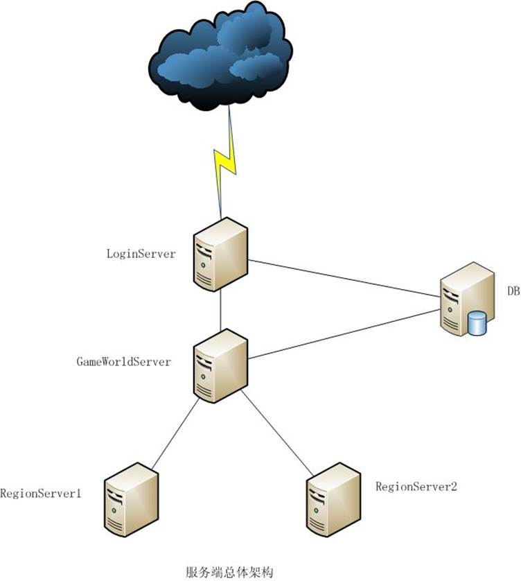 

### 1.2、图解

**LoginServer**：负责认证用户，向客户端返回可用的GameWorldServer列表，向Monitor客户端回应监控数据。与DB（数据库）服务器有直接连接，多一个组可以公用一个。

**GameWorldServer**：世界服务器，负责中转和处理游戏世界里所有全局性数据和功能，比如工会信息，寄卖商店等，并负责管理管理所有的RegionServer，每组服务只能有一个

**RegionServer**：游戏的域服务器，可以把整个游戏世界分散在多个RegionServer中由运行，由GameWorldServer负责用户切换和全局数据同步。大部分游戏逻辑都在这里运行，同时战场和副本也在这个Server中运行。

### 1.3、用户登录流程

1. 连接LoginServer完成用户名密码的认证

2. LoginServer返回可用的GameWorldServer列表

3. 连接GameWorldServer加载自身全局数据并根据上次离线地址分配对应RegionServer

4. 连接RegionServer开始游戏

## 2、loginServer的内部结构

### 2.1、LoginSever主要功能

1，玩家的登陆

2，玩家退出和返回(退出和返回时将计费服务器也同时退出)

3，记录当前登陆服务器玩家的数量

4，创建新的帐号角色

5，解锁和锁定登陆帐号信息

6，设置登陆帐号的权限，密码资料

7，删除登陆帐号

8，登陆用户点卡的扣除和添加

9，登陆用户的激活码等

10，登陆用户的点卡寄卖交易

11，帐号注销

12，返回显示服务器列表信息

13、向Monitor客户端返回服务器的监控信息

### 2.2、描述

LoginServer在最顶层由几个大的全局对象组成主要定义如下：

 

```c++
extern  SConfigLoginNet   g_cfg;               //Net的Config

extern  TCmdList      g_sendCmdList;          //发送消息列表

extern  TCmdList      g_recvCmdList;           //接收消息列表

extern  CLoginServer*   g_lgs;               //服务器主对象

extern  CG_CmdPacket*   g_sendCmd;             //消息的全局发送队列

extern  long        g_dwLoginOrderID;         //登陆的流水帐号ID

extern  CwsdlWrapper*    g_pWSDL;              //主要用来设置网络连接
```


### 2.3、CLoginServer类图

 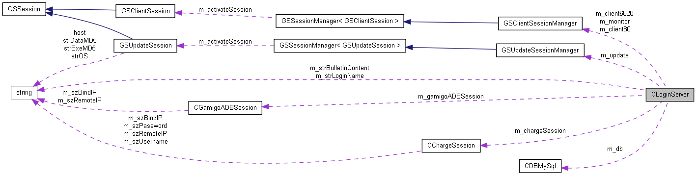

 

## 3、主要流程

### 3.1、服务器启动流程

具体函数可以参阅main.cpp中的main函数，主要流程如下

1. 传入login_server.ini配置文件，

2. 调用StartupServer()，启动服务端，如果不成功，将在16秒后重新启动，

3. 进入RunServer();，在g_lgs->Run()中，并在其中完成配置文件的解析，全局对象的分配，以及一些其他配置文件的加载，直到收到退出信号

   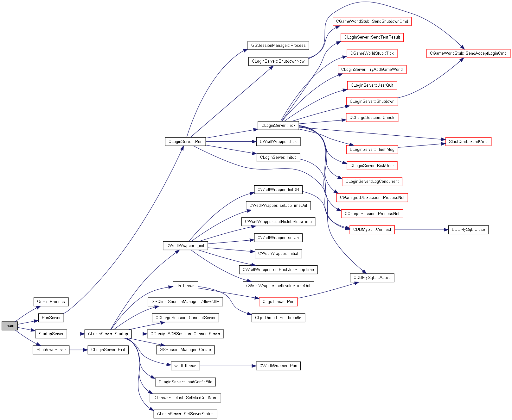   

   ​     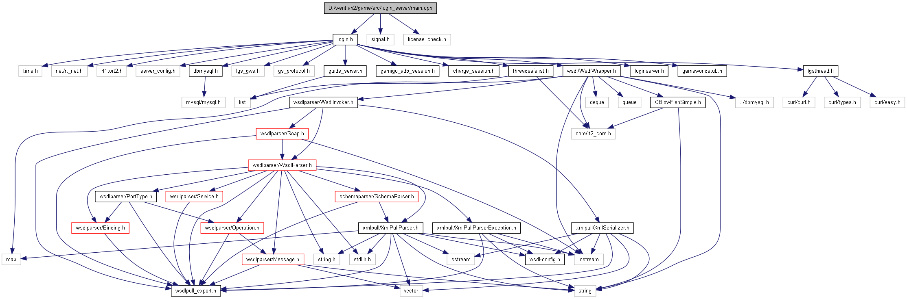

### 3.2、主循环

游戏主循环位于g_lgs->Run()，其调用图如下：

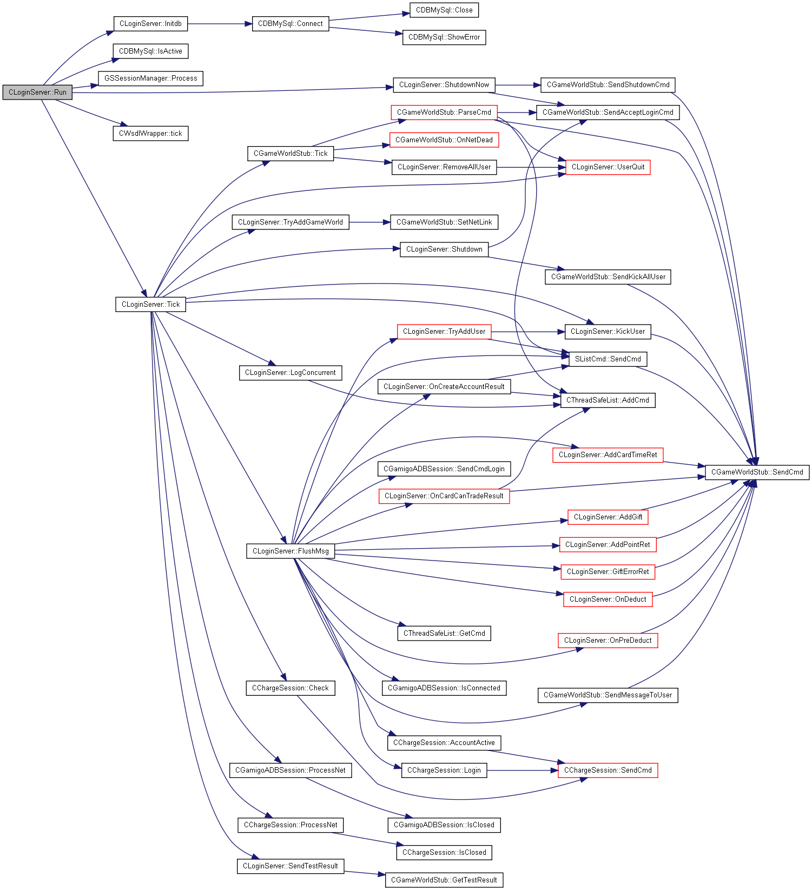 图解：

其主要运行流程如下：

1. 判断数据库是否是连接的，然后对各数据进行初始化

2. 运行Tick函数开始处理其主要的逻辑

3. 在Tick函数中最主要的处理函数是FlushMsg()和pGws->tick().

4. FlushMsg主要是逻辑处理完向GWS服务端发送消息

5. pGws->tick()主要是用来解析接收Gws服务端消息，其中最主要的函数是ParseCmd().

下面将单独说明Tick函数

### 3.3、Tick

调用图：

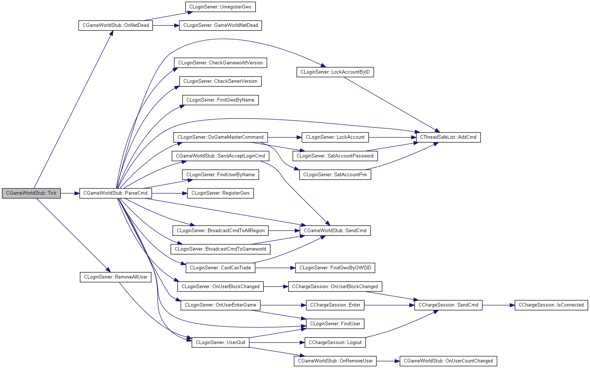此函数运行内容是处理全部的用户登陆逻辑，包括点卡的计费，用户的退出，服务端发出的公告，登陆中遇到的可能的问题的解决等等

其中最重要的是函数ParseCmd 图例关系如下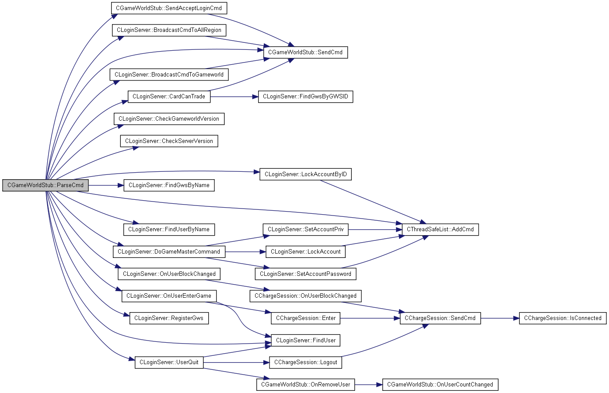


## 4、消息机制

### 4.1、概述

本服务器中，消息主要来自GWS和网络连接，与GWS交互的消息定义在gameworldstub.h中,则与数据库的交互的消息定义在dbmysql.h。

### 4.2、CchargeSession

CchargeSession主要是负责与BillingServer的通信。

在此类中比较重要的函数调用看图例

 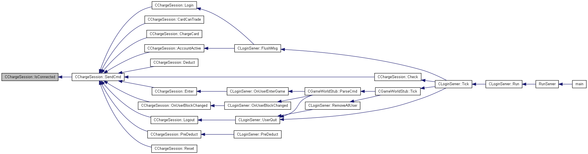

其中对消息进行解析逻辑处理的函数是OnReceive

图例：

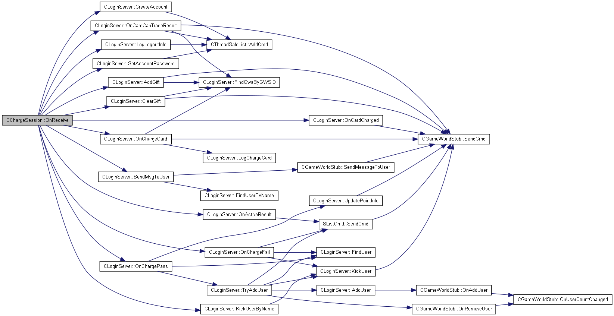

看图我们可以看到处理到的消息最终发送到GWS服务端

### 4.3、CgameWorldStub

主要负责与GameWorldServer的通信。

```c++
class CGameWorldStub

{
public:
  enum EStubState 
  {
 STUB_STATE_NONE,
  //没有和gws连接    
 STUB_STATE_ALIVE,
 // 还在和gws保持连接
STUB_STATE_NT_DEAD,
// gws连接已经断开
 STUB_STATE_SERVER_SHUTDOWNING,
 // 关闭中(发出关闭命令，但是还没有接受到gws已经关闭命令)
// 这时只处理登出命令，其他命令都返回失败
 STUB_STATE_SERVER_SHUTDOWNED,
// 已经关闭 (受到gws已经关闭命令)

 // 现在不应该有任何命令进来了
// 等待关闭连接
  };
//设置网络连接以及调试信息  
 void SetNetLink(CG_TCPSession *link);
//解析消息
 bool ParseCmd(CG_CmdPacket *cmd);
//发送消息
void SendCmd(CG_CmdPacket *cmd);
//处理消息连接各种状态
 bool Tick(long delta);
//断开GWS服务器连接,目前没有需求
void OnNetDead();
 //发送登陆信息
void SendAcceptLoginCmd(bool bAccept);
//发送服务器关闭信息
void SendShutdownCmd(long lDelayTime);
//发送 剔除所有玩家
void SendKickAllUser(long lDelayTime);
//发送消息公告给所有家
 void SendMessageToUser(DWORD dwAccountID, char cMsgType, const char* szMessage);
//测试服务器
void Test();
//返回得到测试的结果
bool GetTestResult(std::string& resultStr);
//计算增加在线玩家数量
void OnAddUser()          { m_userCount++; OnUserCountChanged();}
//计算移除在线玩家
void OnRemoveUser()         { m_userCount--; OnUserCountChanged();}
//计算在线使用者数量
void OnUserCountChanged()；
｝
```

其函数SendCmd为主要发送消息函数

下面为图解：

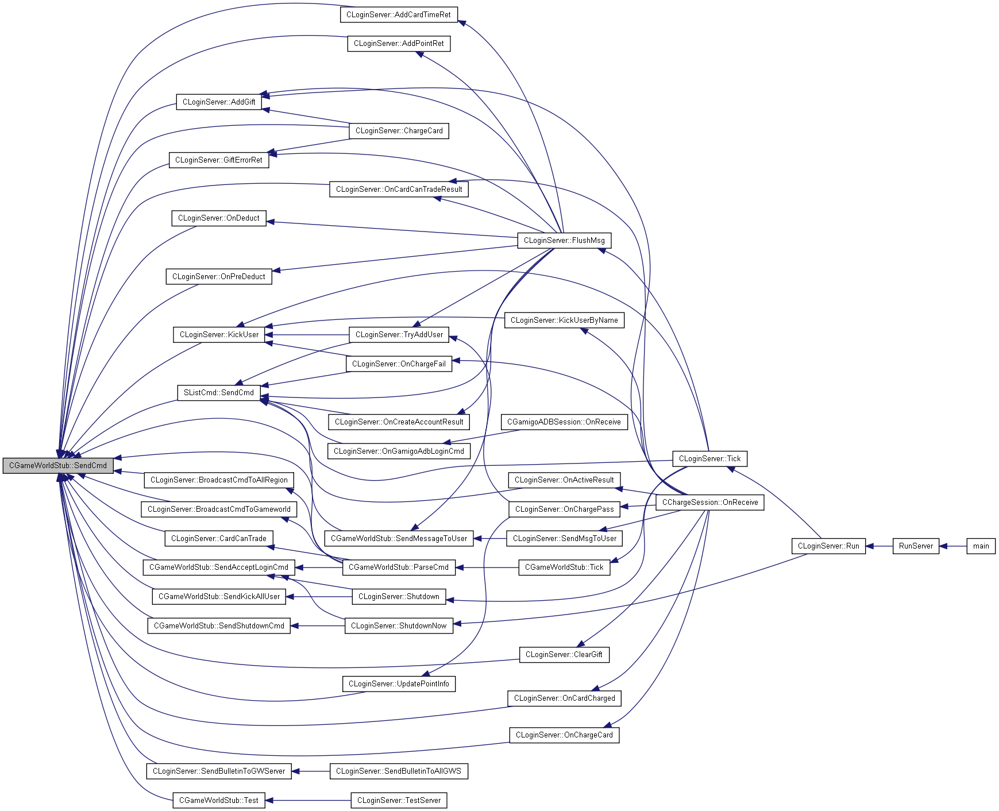

看图可以知道，几乎所有消息最后都是通过SandCmd函数发送给Gws服务端。

### 4.4、CDBMySql和CwsdlWrapper

CDBMySql负责与mysql的数据库连接的封装

CwsdlWrapper负责封装WebService的客户端接口，负责与MemberCenter的通信

```c++
#include <mysql/mysql.h>
class CDBMySql 
{
public:
 // 在给定的连接中，返回由最近的DELETE、INSERT、REPLACE或者UPDATE语句所作用的行数。如果没有行 被修改，则mysql_affected_rows()返回0，如果出现错误，则返回-1。在SELECT查询之后，mysql_affected_rows()返回所选择的行数。但一般是与SELECT语句一道使用。
long GetAffectedRows();
//在数据库中通过ID进行查找
unsigned long GetInsertId();
// 得到字段名，数据类型和数据值
bool GetField(int idx,char *field,int *type,char **value);
//得到字段名和类型基本信息
int GetFieldInfo(int nIdx, char *pszName);
//得到数据类型和值
bool GetFieldContent(int nIdx , int *pnType , char **ppValue)
//得到字段名
char *GetField(char *fname,int *len = 0);
//得到返回单列的各字段
bool GetRow();
//显示错误信息
void ShowError(char *sql);
//得到返回取得返回列的数目
int GetRowCount();
//取得返回字段的数目。
int GetFieldCount();
//连接数据库主要处理函数
bool Query(const char *sql,int len=0);
//返回查找插入到最后的ID
int LastInsertID();
//关闭数据库连接
void Close();
//连接数据库
bool Connect(const char *host,int port,const char *name,const char *pwd,const char *db);
//是否有权限访问数据库
void EnableLog(bool enable);
//是否是活动的，运转的
bool IsActive();
//向数据库写入字符串
std::string EscapeString(const char *str); 
};
```

CwsdlWrapper类主要是用来连接网站数据，并通过CDBMySql类写入数据库中

关系调用图如下：


其服务端与数据库连接关系流程图：

###  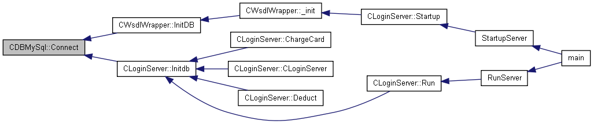

## 5、举例帐号登陆流程

 

   游戏帐户的验证是客户端先和GWS服务端进行通信，通过GWS服务端连接LS服务端。最后进入选择角色的画面，由玩家点击UI再次触发消息进入游戏，GWS服务端会把客户端与LS服务端断开连接，连接到RS服务端。

### 账号登录

1. 首先，服务端启动，客户端启动，在GWS服务端的启动函数bool GWServer::Startup()中，这里要检查Region的个数是否和他匹配。

2. 同时在GWS服务端的启动函数bool GWServer::Startup()中，开启客户端的监听函数

```c++
if(!StartClientListen())
{
   ERR("Client channel initalize err!!!\n");
   return false;
}
```

3. 接收到客户端发来的消息c2g_login，并且初始化为cmd_c2g_login,在函数GW_BEGIN_CMD(cmd_c2g_login)中，执行函数LoginAccount(),发送消息gws2lgs_user_login到LS服务端。

4. 在LS服务端的bool CGameWorldStub::ParseCmd(CG_CmdPacket *pPacket)函数中解析GWS发来的消息，经过逻辑处理，创建帐号等判断，发送消息lgs2gws_user_login_ret回GWS服务端。

5. 在GWS服务端中GW_BEGIN_CMD(cmd_lgs2gws_user_login_ret)函数接收消息，经过逻辑判断等最后发送消息g2c_login_ret到客户端。

6. 在客户端中，BEGIN_CMD_FUNC(cmd_g2c_login_ret)函数中执行函数OnNetLogin，设置登陆状态SetLoginState(GLS_SELECT_CHAR)，执行EnterSelectChar()函数，需要检查数据，执行函数QueryAccountInfo()。发送消息c2g_query_account到GWS服务端。

7. 在GWS服务端中，将客户端消息初始化为cmd_c2g_query_account，在函数GW_BEGIN_CMD(cmd_c2g_query_account)中QueryActorList函数验证数据，发送消息g2c_query_account_ret到客户端。

8. 客户端接收到消息后进入选择角色的界面。

到了这一步，消息中断，因为需要人为操作点击UI按钮再次触发消息。

###  选择人物

1. GWS服务端接收到客户端消息c2g_select_char，初始化为消息cmd_c2g_select_char，在函数GW_BEGIN_CMD(cmd_c2g_select_char)中。
2. 经过判断和逻辑处理后发送消息g2c_select_char_ret到客户端。
3. 客户端接收到消息，在函数BEGIN_CMD_FUNC(cmd_g2c_select_char_ret)中，LoginSession任务完成了，会被GWServer断开连接，连RegionServer了。
4. 登陆进游戏！！

 