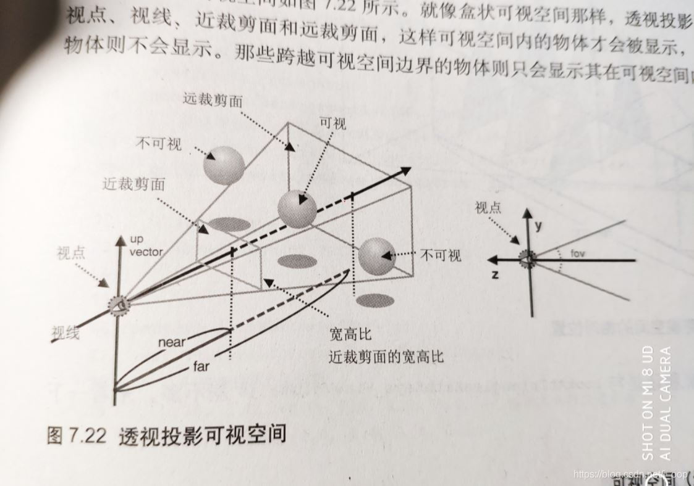

相关资料参考：

1.[游戏引擎浅入浅出](https://www.thisisgame.com.cn/tutorial?book=cpp-game-engine-book&lang=zh&md=Introduction.md) 

2.[第一人称摄像机的实现](https://blog.csdn.net/BonChoix/article/details/8521411)

3.[视图矩阵](https://jiegiser.github.io/note/graphics/webgl%E8%A7%86%E5%9B%BE%E7%9F%A9%E9%98%B5.html)

4.[DirectX11 With Windows SDK--10 基于Transform的摄像机类与GameObject类 ](https://www.cnblogs.com/X-Jun/p/9316048.html)

# 矩阵位置关系变换

## 齐次坐标系

在计算机图形学中，4x4矩阵用于表示3D空间中的位置关系，包括平移、旋转、缩放和投影变换。通过引入第四个坐标（齐次坐标），可以统一表示各种仿射变换。

- **位置坐标** \((x, y, z)\) 在齐次坐标系中表示为 \((x, y, z, 1)\)。
- **方向向量** \((x, y, z)\) 在齐次坐标系中表示为 \((x, y, z, 0)\)。

## 4x4矩阵结构

一个4x4矩阵可以表示为：

$$
\mathbf{M} = \begin{bmatrix}
m_{00} & m_{01} & m_{02} & m_{03} \\
m_{10} & m_{11} & m_{12} & m_{13} \\
m_{20} & m_{21} & m_{22} & m_{23} \\
m_{30} & m_{31} & m_{32} & m_{33}
\end{bmatrix}
$$
其中：
$$
( m_{00}, m_{01}, m_{02}, m_{10}, m_{11}, m_{12}, m_{20}, m_{21}, m_{22} )\\表示旋转和缩放。
$$

$$
( m_{30}, m_{31}, m_{32} )\\表示平移。
$$

$$
第四列 ( m_{03}, m_{11}, m_{23}, m_{33} ) \\在通常的仿射变换中为 ( 0, 0, 0, 1 )。
$$

$$
将点 (x, y, z, 1) 平移到 (x + t_x, y + t_y, z + t_z, 1)\\
\mathbf{T} = \begin{bmatrix}
1 & 0 & 0 & 0 \\
0 & 1 & 0 & 0 \\
0 & 0 & 1 & 0 \\
t_x & t_y & t_z & 1
\end{bmatrix}
$$

详见[D3D坐标系文档](https://learn.microsoft.com/zh-cn/windows/win32/direct3d9/coordinate-systems)

### 旋转

$$
绕Z轴旋转矩阵（角度为 ）：\theta \\
\mathbf{R_z} = \begin{bmatrix}
\cos\theta & -\sin\theta & 0 & 0 \\
\sin\theta & \cos\theta  & 0 & 0 \\
0          & 0           & 1 & 0 \\
0          & 0           & 0 & 1
\end{bmatrix}
$$

首先要明确旋转在二维中是绕着某一个点进行旋转，三维中是绕着某一个轴进行旋转。

二维旋转中最简单的场景是绕着坐标原点进行的旋转，如下图所示：

​	 

如图所示点v 绕 原点旋转θ角得到点v’，假设 v点的坐标是(x, y) ，

那么可以推导得到 v’点的坐标（x’, y’)

(设原点到v的距离是r，原点到v点的向量与x轴的夹角是𝜙 )
$$
x=rcosϕ\\y=rsinϕ\\
x′=rcos(θ+ϕ)\\y′=rsin(θ+ϕ)\\
通过三角函数展开得到:\\
x′=rcosθcosϕ−rsinθsinϕ\\
y′=rsinθcosϕ+rcosθsinϕ\\
写成矩阵的形式是
\begin{bmatrix}
\cos\theta & -\sin\theta  \\
\sin\theta & \cos\theta   \\
\end{bmatrix}
$$

### 缩放

$$
将点 (x, y, z, 1) 缩放到 (s_x \cdot x, s_y \cdot y, s_z \cdot z, 1)\\
\mathbf{S} = \begin{bmatrix}
s_x & 0   & 0   & 0 \\
0   & s_y & 0   & 0 \\
0   & 0   & s_z & 0 \\
0   & 0   & 0   & 1
\end{bmatrix}
$$

## 综合变换

多个变换可以组合成一个复合变换矩阵，例如：

$$
\mathbf{M} = \mathbf{T} \cdot \mathbf{R_z} \cdot \mathbf{S}
$$
变换的顺序非常重要，因为矩阵乘法不是交换的。顺序决定了每个变换是相对于原点还是相对于变换后的坐标系进行的。

## 示例

假设有以下变换：
1. 平移 \( t_x = 2, t_y = 3, t_z = 4 \)
2. 绕 Z 轴旋转 30 度
3. 没有缩放

综合变换矩阵为：

$$
\mathbf{M} = \begin{bmatrix}
0.866 & -0.5  & 0    & 2 \\
0.5   & 0.866 & 0    & 3 \\
0     & 0     & 1    & 4 \\
0     & 0     & 0    & 1
\end{bmatrix}
$$

## 总结

- \((x', y', z', 1)\) 表示经过变换后的三维空间中的新位置坐标。
- 齐次坐标的第四个分量 \(1\) 表示这是一个位置坐标，能够参与平移变换。
- 通过4x4变换矩阵，可以对位置坐标进行各种仿射变换，包括平移、旋转和缩放。

# 相机相关知识

远近截面决定了可视范围

[正交投影变换](https://zhuanlan.zhihu.com/p/473031788)

[Billboard](https://blog.csdn.net/b491985496/article/details/79402291)

# 坐标

1. **物体坐标**: 这是物体在本地空间中的位置。每个物体都有自己的坐标系，用于定义其顶点位置。例如，当我们绘制一个三角形时，这个三角形的顶点坐标就是在物体坐标系中的位置。
2. **模型矩阵**: 模型矩阵用于将物体坐标转换为全局坐标。简单来说，它描述了物体在空间中的位置和方向。例如，glTranslate和glRotate函数就是用来设置模型矩阵的。
3. **视图矩阵**: 视图矩阵描述了观察者（或者说摄像机）的位置和方向。它用于将全局坐标转换为视觉坐标。视图矩阵决定了哪些物体应该被渲染以及它们在屏幕上的位置。
4. **投影矩阵**: 投影矩阵定义了如何将3D场景映射到2D屏幕上。它决定了物体的尺寸和形状在屏幕上的表示方式。常见的投影类型包括正交投影和透视投影。
5. **像素屏幕坐标**: 最后，经过投影矩阵变换后的顶点坐标就是像素屏幕坐标。这些坐标表示了顶点在屏幕上的位置，通常范围在-1到1之间。

# Dx11世界矩阵和观察矩阵的联系

若已知物体所在位置 Q=(Qx,Qy,Qz)，以及三个互相垂直的坐标轴 u=(ux,uy,uz) v=(vx,vy,vz) w=(wx,wy,wz)

并且物体的xyz缩放比例都为1，则我们可以得到对应的世界矩阵：
$$
\mathbf{W}=\mathbf{RT}=
\begin{bmatrix} 
u_{x} & u_{y} & u_{z} & 0 \\
v_{x} & v_{y} & v_{z} & 0 \\
w_{x} & w_{y} & w_{z} & 0 \\
0 & 0 & 0 & 1
\end{bmatrix}
\begin{bmatrix} 
1 & 0 & 0 & 0 \\
0 & 1 & 0 & 0 \\
0 & 0 & 1 & 0 \\
Q_{x} & Q_{y} & Q_{z} & 1
\end{bmatrix}=
\begin{bmatrix} 
u_{x} & u_{y} & u_{z} & 0 \\
v_{x} & v_{y} & v_{z} & 0 \\
w_{x} & w_{y} & w_{z} & 0 \\
Q_{x} & Q_{y} & Q_{z} & 1
 \end{bmatrix}
$$
我们可以把上述变换看作：
将物体从世界坐标原点搬移到世界坐标系对应的位置，并按其坐标轴做对应朝向和大小的调整。

然而现在我们需要做的是从世界坐标系转换到观察空间坐标系，如果把摄像机看做物体的话，实际上观察空间坐标系就是摄像机物体的局部坐标系(右方向为X轴，上方向为Y轴，目视方向为Z轴）。

因此我们现在做的是从世界坐标系变换回摄像机的局部坐标系，即世界矩阵的逆变换：
$$
\mathbf{V}=\mathbf{(RT)}^{-1}=\mathbf{T}^{-1}\mathbf{R}^{-1}=\mathbf{T}^{-1}\mathbf{R}^{T}
$$

$$
\mathbf{V}=\begin{bmatrix} 
u_{x} & v_{x} & w_{x} & 0 \\
u_{y} & v_{y} & w_{y} & 0 \\
u_{z} & v_{z} & w_{z} & 0 \\
-\mathbf{Q}\cdot\mathbf{u} & -\mathbf{Q}\cdot\mathbf{v} & -\mathbf{Q}\cdot\mathbf{w} & 1
 \end{bmatrix}
$$

