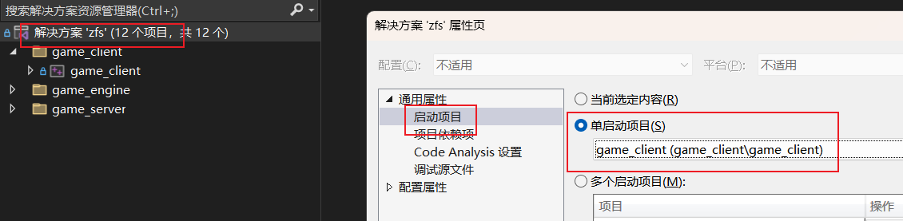

## GC编译指南

### 1.配置vcpkg

```shell
#在任意目录clone vcpkg --depth 1   代表只拉取最新一次的提交
git clone --depth 1 https://github.com/microsoft/vcpkg.git
```

```shell
#到 `vcpkg` 目录并执行启动脚本：bootstrap-vcpkg.bat 会自动下载vcpkg.exe
#然后打开控制台输入下面的命令:
vcpkg.exe integrate install
```

输出应该如下：

```shell
D:\DevelopSoftWare\vcpkg>vcpkg.exe integrate install
Applied user-wide integration for this vcpkg root.
All MSBuild C++ projects can now #include any installed libraries. Linking will be handled automatically. Installing new libraries will make them instantly available.
```

到vs配置vcpkg属性


参考资料：

[搜索c++库](https://vcpkg.io/en/packages)

[vcpkg说明文档](https://learn.microsoft.com/zh-cn/vcpkg/get_started/overview)

### 2.拉取项目

```shell
git clone --branch main --depth 1 https://github.com/reniao69/zfs.git
##或者
git clone --branch main --depth 1 https://gitee.com/chuangxxt/zfs.git

```

### 3.配置visual studio 2022

#### 3.1配置启动项为客户端



#### 3.2配置客户端项目属性


```
注意客户端已经使用c++17标准 ，因为很多语法糖
```


```
配置项目属性->
预编译头
选择使用/Yu
头文件为stdafx.h
加快编译速度
```


```
找到stdafx.cpp
右键编辑属性
选择 创建/YC  
注意是创建不是使用
```

#### 3.3开始编译

```
直接启动就行了，第一次加载vcpkg会很久，后面就快了
```

